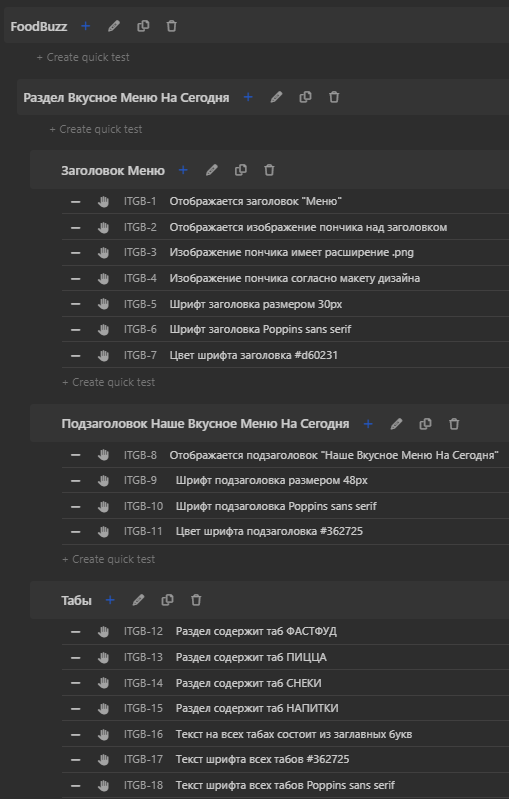

# Написание тестовой документации

Рассмотрим основную тестовую документацию:

+ чек-лист;
+ тест-кейс;
+ тестовый набор;
+ отчет о дефекте.

## Чек-лист

> Тестировщику приходится работать с огромным количеством информации, выбирать из множества вариантов
> решения задач и изобретать новые. В процессе этой деятельности объективно невозможно удержать в голове все мысли, а
> потому продумывание и разработку тест-кейсов рекомендуется выполнять с использованием «чек-листов».
>
> [«Тестирование программного обеспечения. Базовый курс.»](https://svyatoslav.biz/software_testing_book/)

Чек-лист - это список проверок, который может обладать низкой детализацией и зачастую понятен для глубоко погруженных в
проект специалистов и трудно воспринимаем новыми сотрудниками.

Святослав Куликов дает такое понятие чек-листа:

> Чек-лист (checklist) — набор идей [тест-кейсов]. Последнее слово не зря
> взято в скобки, т.к. в общем случае чек-лист — это просто набор идей:
> идей по тестированию, идей по разработке, идей по планированию и
> управлению — любых идей.
>
> [«Тестирование программного обеспечения. Базовый курс.»](https://svyatoslav.biz/software_testing_book/)

Чек-лист обычно представляет из себя хорошо известный всем список.

+ Этот список может быть маркированны, где последовательность пунктов не важна для проведения проверок.
+ Нумерованный связный список, где каждая последующая проверка строится на результате предыдущей. В таком чписке важна
  очередность выполнения пунктов.
+ Многоуровневый список. В котором выделены отдельные компоненты, чтобы отразить иерархию и структуру проверок.

### Правила составления чек-листа

1. Один пункт – одна операция.
2. Пункты всегда начинаются с существительного или
   глагола неопределенной формы.
3. Соблюдать структуру.
4. Опираться на требования.
5. Давать пунктам чек-листа названия по форме, общей
   для всех членов команды.

Так может выглядеть многоуровневый несвязный чек-лист:

### Резолюция чек-листа

1. passed – кейс прошел проверку;
2. failed – кейс не прошел проверку;
3. skipped – пропуск проверки;
4. blocked – нет возможности проверить;
5. untested – еще не брали в работу.

### Преимущества и недостатки чек-листов

#### Преимущества.

+ Чек-листы затрагивают большее количество кейсов, так как
  при прохождении их можно по-разному выполнять.
+ Сокращают затраты на содержание и поддержку тестов.
+ Обеспечивают высокую скорость тестирования: не нужно отмечать результат
  каждого шага тестировщика, достаточно общего результата проверки.
+ Чек-листы затрагивают большее количество кейсов, так как
  при прохождении их можно по-разному выполнять.
+ Сокращают затраты на содержание и поддержку тестов.
+ Обеспечивают высокую скорость тестирования: не нужно отмечать результат
  каждого шага тестировщика, достаточно общего результата проверки.
+ Позволяют проходить и комбинировать тесты по-разному, в зависимости
  от предпочтений сотрудников.
+ Показывают статистику: кто, когда и что проходил — с детализацией
  по сборке продукта и окружению, на котором проводилось тестирование.
+ Улучшают представление о системе в целом, показывают статус
  ее готовности.
+ Показывают объем проделанной и предстоящей работы по тестированию.

#### Недостатки.

+ Начинающие тестировщики не всегда эффективно проводят тесты
  без достаточно подробной документации.
+ Чек-листы невозможно использовать для обучения
  начинающих сотрудников, так как в них недостаточно
  подробных сведений.
+ Заказчику или руководству может быть недостаточно
  того уровня детализации, который предлагают чек-листы.
+ Неопределенность тестового набора: каждый тестировщик
  выполняет пункт чек-листа по-своему.

## Тест-кейс

> Тест-кейс (test case) — набор входных данных, условий выполнения и
> ожидаемых результатов, разработанный с целью проверки того или иного
> свойства или поведения программного средства.
> Под тест-кейсом также может пониматься соответствующий документ,
> представляющий формальную запись тест-кейса.
>
> [«Тестирование программного обеспечения. Базовый курс.»](https://svyatoslav.biz/software_testing_book/)

Тест-кейс содержит обязательные атрибуты:

+ уникальный идентификатор;
+ название, отражающее суть проверки;
+ шаги воспроизведения;
+ ожидаемый результат;
+ тестовые данные;
+ фактический результат;
+ статус (резолюция).

Обязательные атрибуты чаще всего дополняются следующими атрибутами:

+ приоритет тест-кейса;
+ предусловия;
+ постусловия;
+ связанное с тест-кейсом требование;
+ модуль и подмодуль приложения.

### Резолюция тест-кейса

1. passed – кейс прошел проверку;
2. failed – кейс не прошел проверку;
3. skipped – пропуск проверки;
4. blocked – нет возможности проверить;
5. untested – еще не брали в работу.

### Преимущества и недостатки тест-кейсов

#### Преимущества

+ За счет полной детализации шагов тест-кейсы может проходить
  новичок, а также по тест-кейсам довольно удобно знакомиться
  с продуктом.
+ Достаточно подробное описание бизнес-логики. При неидеальной
  организации хранения требований, уточнение некоторых моментов
  проще будет найти в тест-кейсах.

#### Недостатки

+ В сравнении с чек-листами требуют много времени на написание.
+ Сложно поддерживать. При изменении бизнес-логики,
  переименовании разделов и прочих изменениях, затрагивающих
  пользовательский интерфейс и сценарии использования системы,
  нужно актуализировать все тест-кейсы, затрагивающие измененную
  часть.

О том как правильно писать тест-кейсы и чек-листы, какие свойства качественной тестовой документации хорошо написано в
книге «Тестирование программного обеспечения. Базовый курс.».

### Список качественных свойст:

> Правильный технический язык, точность и единообразие формулировок.
> + пишите лаконично, но понятно;
> + используйте безличную форму глаголов (например, «открыть» вместо «откройте»);
> + обязательно указывайте точные имена и технически верные названия элементов приложения;
> + не объясняйте базовые принципы работы с компьютером (предполагается,
    > что ваши коллеги знают, что такое, например, «пункт меню» и как с ним работать);
> + везде называйте одни и те же вещи одинаково (например, нельзя в одном
    > тест-кейсе некий режим работы приложения назвать «графическое представление», а в другом тот же режим —
    «визуальное
    > отображение», т.к. многие
    > люди могут подумать, что речь идёт о разных вещах);
> + следуйте принятому на проекте стандарту оформления и написания тесткейсов (иногда такие стандарты могут быть весьма
    > жёсткими: вплоть до регламентации того, названия каких элементов должны быть приведены в
    > двойных кавычках, а каких — в одинарных).
>
> [«Тестирование программного обеспечения. Базовый курс.»](https://svyatoslav.biz/software_testing_book/)

> Баланс между специфичностью и общностью.
>
> Почему плоха излишняя специфичность (тест-кейс 1):
> + при повторных выполнениях тест-кейса всегда будут выполняться строго
    одни и те же действия со строго одними и теми же данными, что снижает
    вероятность обнаружения ошибки;
> + возрастает время написания, доработки и даже просто прочтения тест-кейса;
> + в случае выполнения тривиальных действий опытные специалисты тратят
    дополнительные мыслительные ресурсы в попытках понять, что же они упустили из виду, т.к. они привыкли, что так
    описываются только самые сложные
    и неочевидные ситуации.
>
> Почему плоха излишняя общность (тест-кейс 2):
> + тест-кейс сложен для выполнения начинающими тестировщиками или даже
    опытными специалистами, лишь недавно подключившимися к проекту;
> + недобросовестные сотрудники склонны халатно относиться к таким тест-кейсам;
> + тестировщик, выполняющий тест-кейс, может понять его иначе, чем было задумано автором (и в итоге будет выполнен
    фактически совсем другой тесткейс).
>
> [«Тестирование программного обеспечения. Базовый курс.»](https://svyatoslav.biz/software_testing_book/)

> Баланс между простотой и сложностью.
>
> Преимущества простых тест-кейсов:
> + их можно быстро прочесть, легко понять и выполнить;
> + они понятны начинающим тестировщикам и новым людям на проекте;
> + они делают наличие ошибки очевидным (как правило, в них предполагается
    выполнение повседневных тривиальных действий, проблемы с которыми
    видны невооружённым взглядом и не вызывают дискуссий);
> + они упрощают начальную диагностику ошибки, т.к. сужают круг поиска.
>
> Преимущества сложных тест-кейсов:
> + при взаимодействии многих объектов повышается вероятность возникновения ошибки;
> + пользователи, как правило, используют сложные сценарии, а потому сложные тесты более полноценно эмулируют работу
    пользователей;
> + программисты редко проверяют такие сложные случаи (и они совершенно не
    обязаны это делать).
>
> [«Тестирование программного обеспечения. Базовый курс.»](https://svyatoslav.biz/software_testing_book/)

> «Показательность» (высокая вероятность обнаружения ошибки).
> Начиная с уровня тестирования критического пути , можно утверждать, что тест-кейс
> является тем более хорошим, чем он более показателен (с большей вероятностью
> обнаруживает ошибку). Именно поэтому мы считаем непригодными слишком простые тест-кейсы — они непоказательны.
>
> [«Тестирование программного обеспечения. Базовый курс.»](https://svyatoslav.biz/software_testing_book/)

> Последовательность в достижении цели.
> Суть этого свойства выражается
> в том, что все действия в тест-кейсе направлены на следование единой логике и
> достижение единой цели и не содержат никаких отклонений.
>
> [«Тестирование программного обеспечения. Базовый курс.»](https://svyatoslav.biz/software_testing_book/)

> Отсутствие лишних действий.
> Чаще всего это свойство подразумевает, что
> не нужно в шагах тест-кейса долго и по пунктам расписывать то, что можно заменить одной фразой.
>
> [«Тестирование программного обеспечения. Базовый курс.»](https://svyatoslav.biz/software_testing_book/)

## Регрессионное тестирование и ретест

Регрессионное тестирование (regression testing) —
тестирование уже проверенной функциональности
после внесения изменений в код приложения
для уверенности, что эти изменения не внесли
или не активизировали ошибки в областях,
которые не подвергались изменениям.

Ре-тест или подтверждающее тестирование (re-test, acceptance testing) — проводится в случае, если фича/функциональность
уже имела дефекты, и эти дефекты были недавно исправлены.

Подробнее о таких видах тестирования как "дымовое", «санитарное тестирование», «ре-тест» и регрессионное тестирование
можно прочитать в
статье [В чём разница Smoke, Sanity, Regression, Re-test и как их различать?](https://habr.com/ru/post/358142/)
