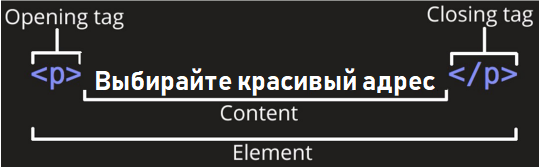
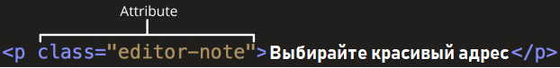

# Основы HTML

## Что такое HTML

HTML (Hypertext Markup Language) - это код, который используется для структурирования и отображения вебстраницы и её
контента. Например, контент (какой-то текст) может быть представлен в виде множества параграфов, маркированных списков
или с использованием изображений и таблиц данных. Пришло время познакомиться с основами HTML и его функциями.

Разметка в HTML осуществляется с помощью тегов – это метки, размечающие и каталогизирующие информацию для облегчения
процесса поиска. Иными словами, теги – это ключевые слова, по которым браузер ориентируется, как воспринимать и
оформлять материал на сайте.

Например, предложение на сайте.

> Выбирайте красивый адрес

На самом деле будет обернуто тегами, сообщающим браузеру, что это текст абзаца, выглядит так:

```html
<p> Выбирайте красивый адрес </p>
```

## Анатомия HTML элемента



### Главными частями нашего элемента являются:

1. **Открывающий тег (Opening tag)**. Состоит из имени элемента (в данном случае, `p`), заключённого в
   открывающие и закрывающие угловые скобки. Открывающий тег указывает, где элемент начинается
   или начинает действовать, в данном случае — где начинается абзац.
2. **Закрывающий тег (Closing tag)**. Это то же самое, что и открывающий тег, за исключением того, что он
   включает в себя косую черту перед именем элемента. Закрывающий элемент указывает, где элемент
   заканчивается, в данном случае — где заканчивается абзац. Отсутствие закрывающего тега является
   одной из наиболее распространённых ошибок начинающих и может приводить к странным
   результатам.
3. **Контент (Content)**. Это контент элемента, который в данном случае является просто текстом.
4. **Элемент(Element)**. Открывающий тег, закрывающий тег и контент вместе составляют элемент.

### Элементы также могут иметь атрибуты, которые выглядят так:

```html
<p align=”center”> Выбирайте красивый адрес </p>
```

У тегов могут быть какие-либо свойства. Например, мы хотим в приведенном примере выровнять текст по центру, для этого мы
будем использовать атрибут `align` со значением `centre`, которое укажем в кавычках.

Атрибуты содержат дополнительную информацию об элементе, которую вы не хотите показывать в фактическом контенте.



В данном случае, `class` это имя атрибута, а `editor-note` это значение атрибута. Класс позволяет дать элементу
идентификационное имя, которое может позже использоваться, чтобы обращаться к элементу с информацией о стиле и прочих
вещах.

### Атрибут всегда должен иметь:

1. пробел между ним и именем элемента (или предыдущим атрибутом, если элемент уже имеет один или несколько атрибутов);
2. имя атрибута, за которым следует знак равенства;
3. значение атрибута, заключённое с двух сторон в кавычки.

## Вложенные элементы

Мы также можем располагать элементы внутри других элементов — это называется вложением.
Мы можем указывать на сильный акцент слова, заключив его в следующий тег:

```html
<strong>
```

Например:

```html
<p>Выбирайте<strong>красивый адрес</p></strong>
```

Будет выглядеть в браузере так:

> Выбирайте **красивый адрес**

Элементы должны открываться и закрываться правильно, поэтому они явно располагаются внутри или снаружи друг друга. Если
они перекрываются, как в примере выше, веб-браузер будет пытаться сделать наилучшее предположение на основе того, что вы
пытались сказать, что может привести к неожиданным результатам. Так что не стоит этого делать!

## Пустые элементы

Некоторые элементы не имеют контента, и называются пустыми элементами.

Возьмём элемент

```html

```

который будем использовать на нашей HTML-странице:

```html

```

Он содержит два атрибута – `src` – для указания пути (где лежит наша картинка) и `alt` – для подсказки (даже если
картинка не загрузится, подсказка расскажет, что там должно было отображаться), но не имеет закрывающего
тега ```</img>```, и никакого внутреннего контента. Это потому, что элемент изображения не оборачивает контент для
влияния на него. Его целью является вставка изображения в HTML страницу в нужном месте.

## Анатомия HTML документа

Мы завершили изучение основ отдельных HTML элементов, но они не очень полезны сами по себе. Теперь посмотрим, как
отдельные элементы объединяются в целую HTML страницу.

Давайте откроем текстовый файл test_html.html:

```html
<!DOCTYPE html>
<html>

<head>
    <meta charset="utf-8">
    <title>Моя тестовая страница</title>
</head>

<body>

</body>

</html>
```

Здесь мы имеем:

* `!DOCTYPE html` — доктайп. В прошлом, когда HTML был молод (около 1991/1992), доктайпы должны
  были выступать в качестве ссылки на набор правил, которым HTML страница должна была следовать,
  чтобы считаться хорошим HTML, что могло означать автоматическую проверку ошибок и другие
  полезные вещи. Однако в наши дни, никто не заботится об этом, и они на самом деле просто
  исторический артефакт, который должен быть включён для того, что бы все работало правильно. На
  данный момент это все, что вам нужно знать.
* `html` — этот элемент оборачивает весь контент на всей странице, и иногда
  известен как корневой элемент.
* `head` — этот элемент выступает в качестве контейнера для всего, что вы
  пожелаете включить на HTML страницу, но не являющегося контентом, который вы показываете
  пользователям вашей страницы. К ним относятся такие вещи, как ключевые слова и описание
  страницы, которые будут появляться в результатах поиска, стили нашего контента, кодировка,
  подключаемые шрифты и многое другое.
* `body` — в нем содержится весь контент, который вы хотите показывать
  пользователям, когда они посещают вашу страницу, будь то текст, изображения, видео, игры,
  проигрываемые аудиодорожки или что-то ещё.
* `meta charset="utf-8"` — этот элемент устанавливает UTF-8 кодировку вашего документа, которая
  включает в себя большинство символов из всех известных человечеству языков. По сути, теперь
  документ может обрабатывать любой текстовый контент, который вы в него вложите. Нет причин не
  устанавливать её, так как это может помочь избежать некоторых проблем в дальнейшем.
* `title` — этот элемент устанавливает заголовок для вашей страницы, который
  является названием, появляющимся на вкладке браузера загружаемой страницы, и используется для
  описания страницы, когда вы добавляете её в закладки/избранное.

Можно открыть документ test_html.html в браузере и посмотреть, как он выглядит.

## Изображения

Давайте снова обратим наше внимание на элемент изображения:

```html

```

Как было сказано раньше, код встраивает изображение на нашу страницу в нужном месте. Это делается с
помощью атрибута `src` (source, источник), который содержит путь к нашему файлу изображения. Путь может
быть указан ссылкой на любую картинку из Интернета как в нашем случае или связывать файл, находящийся
на вашем диске. Для последнего нужно указать название всех папок, которые вложены друг в друга и
содержат ваш файл. Например, если ваш файл `2GU.gif` находится на рабочем столе учетной записи `computer`
в папке `image`, то путь будет выглядеть вот так:

```
src="C:\Users\computer\Desktop\image\2GU.gif”
```

Можно упростить себе жизнь, заранее поместив html-страницу и картинку в одну папку, тогда достаточно
указать только имя:

```
src="2GU.gif”
```

Мы также включили атрибут `alt` (alternative, альтернатива). В этом атрибуте, вы указываете поясняющий текст
для пользователей, которые не могут увидеть изображение, возможно, по следующим причинам:

1. У них присутствуют нарушения зрения. Пользователи со значительным нарушением зрения часто
   используют инструменты, называемые Screen Readers (экранные дикторы), которые читают для них
   альтернативный текст.
2. Что-то пошло не так, в результате чего изображение не отобразилось.

Альтернативный текст - это "пояснительный текст". Он должен предоставить читателю достаточно
информации, чтобы иметь представление о том, что передаёт изображение. В этом примере наш текст "Моё
тестовое изображение" не годится. Намного лучшей альтернативой для нашей картинки будет "gif with a cat".

## Заголовки

Элементы заголовка позволяют указывать определённые части контента в качестве заголовков или
подзаголовков. Точно так же, как книга имеет название, названия глав и подзаголовков, HTML документ
может содержать то же самое. HTML включает шесть уровней заголовков: `h1`, `h2`, `h3`...

```html
<h1>Мой главный заголовок</h1>
<h2>Мой заголовок верхнего уровня</h2>
<h3>Мой подзаголовок</h3>
<h4>Мой под-подзаголовок</h4>
```

## Абзацы

Как было сказано ранее, элемент p предназначен для абзацев текста; вы будете использовать их регулярно
при разметке текстового контента:

```html
<p>Это одиночный абзац</p>
```

## Списки

Большая часть веб-контента является списками и HTML имеет специальные элементы для них. Разметка
списка всегда состоит по меньшей мере из двух элементов. Наиболее распространёнными типами списков
являются нумерованные и ненумерованные списки:

1. Ненумерованные списки - это списки, где порядок пунктов не имеет значения, как в списке
   покупок. Они оборачиваются в элемент `ul`.
2. Нумерованные списки - это списки, где порядок пунктов имеет значение, как в рецепте. Они
   оборачиваются в элемент `ol`.

Каждый пункт внутри списков располагается внутри элемента `li` (list item, элемент списка).
Например, если мы хотим включить часть следующего фрагмента абзаца в список:

```html
<p>Купить в магазине:</p>
<ul>
    <li>Чай</li>
    <li>Кофе</li>
    <li>Сахар</li>
</ul>
<p>Занести домой.</p>
```

## Ссылки

Ссылки очень важны — это то, что делает Интернет Интернетом. Чтобы добавить ссылку, нам нужно
использовать простой элемент — `a` — a это сокращение от "anchor" ("якорь"). Чтобы текст в вашем абзаце
стал ссылкой, выполните следующие действия:

1. Выберите текст.
2. Обернем текст в элемент a, например так:

```html
<a>в магазине</a>
```

3. Зададим элементу a атрибут `href`, например так:

```html
<a href="">в магазине</a>
```

4. Заполним значение этого атрибута веб-адресом, на который хотим указать ссылку:

```html
<a href="https://www.google.com/">в магазине</a>
```

Познакомившись с возможностями HTML, мы увидели, на что он способен. Это классно, но пока это не похоже
на современный сайт. Нам нужны дополнительные инструменты – и это CSS (Cascading Style Sheets).

Попробуйте закрепить пройденный материал на практике и поэкспериментируйте с файлом test_html.html.

Дополнительно про HTML вы можете прочитать тут:

[developer.mozilla.org](https://developer.mozilla.org/ru/docs/Learn/Getting_started_with_the_web/HTML_basics)
