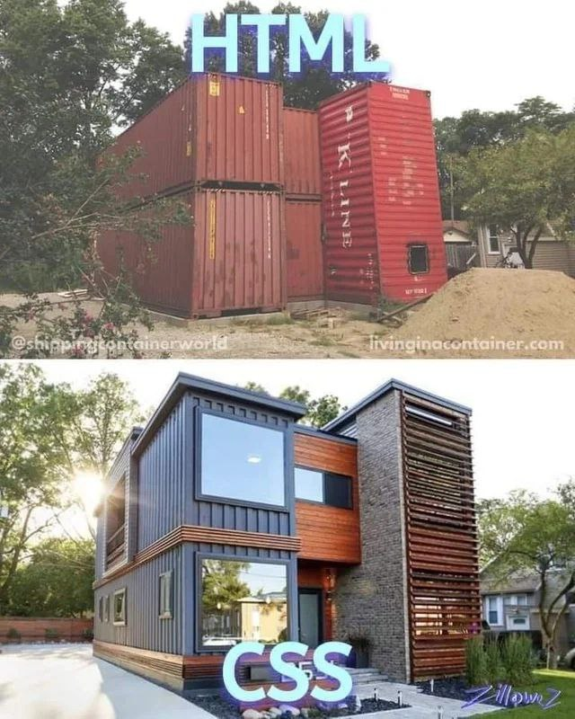
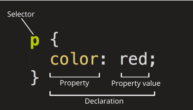

# Основы CSS



CSS (Cascading Style Sheets) — это код, который вы используете для стилизации вашей веб-страницы. Основы
CSS помогут сделать текст черным или красным, поставить контент в определённом месте на экране,
украсить веб-страницу с помощью фоновых изображений и цветов.

Как и HTML, CSS на самом деле не является языком программирования. Это не язык разметки - это язык
таблицы стилей. Это означает, что он позволяет применять стили выборочно к элементам в документах HTML.
Например, чтобы выбрать все элементы абзаца на HTML странице и изменить текст внутри них с чёрного
на красный, необходимо написать этот CSS код:

```css
p {
 color: red;
}
```

Давайте вставим эти три строки CSS в новый файл в ваш текстовый редактор, а затем сохраним файл
как `style.css` в вашей папке `styles` (в ту же папку, где находится наша страница «первая HTML-страница.html»).

Но нам всё равно нужно применить CSS к нашему HTML документу. В противном случае, CSS стиль не повлияет на то, как ваш
браузер отобразит HTML документ.

1. Откройте ваш файл `index.html` и вставьте следующую строку куда-нибудь в шапку, между `head` тегами:

```html

<link href="style.css" rel="stylesheet" type="text/css">
```

2. Сохраните `index.html` и загрузите его в вашем браузере.

Если текст вашего абзаца теперь красный, примите наши поздравления! Вы написали свой первый успешный CSS!

## Анатомия набора правил CSS

Давайте взглянем на вышеупомянутый CSS немного более подробно:



Вся структура называется набором правил (но зачастую для краткости "правило"). Отметим также имена отдельных частей:

+ **Селектор (Selector)**

  Имя HTML-элемента в начале набора правил. Он выбирает элемент(ы) для применения стиля (в данном
  случае, элементы `p`). Для стилизации другого элемента, просто измените селектор.

+ **Объявление (Declaration)**

  Единственное правило, например color: red; указывает, какие из свойств элемента вы хотите стилизовать.

+ **Свойства (Properties)**

  Способы, которыми вы можете стилизовать определённый HTML-элемент (в данном случае, color является
  свойством для элементов `p`). В CSS вы выбираете, какие свойства вы хотите затронуть в вашем правиле.

+ **Значение свойства (Property value)**

  Справа от свойства, после двоеточия, у нас есть значение свойства, которое выбирает одно из множества
  возможных признаков для данного свойства (существует множество значений color, помимо red)

Обратите внимание на важные части синтаксиса:

+ Каждый набор правил (кроме селектора) должен быть обёрнут в фигурные скобки `{}`.
+ В каждом объявлении необходимо использовать двоеточие `:`, чтобы отделить свойство от его
  значений.
+ В каждом наборе правил вы должны использовать точку с запятой `;`, чтобы отделить каждое
  объявление от следующего.

Таким образом, чтобы изменить несколько значений свойств сразу, вам просто нужно написать их, разделяя
точкой с запятой, например так:

```css
p {
 color: red;
 width: 500px;
 border: 1px solid black;
}
```

## Выбор нескольких элементов

Вы также можете выбрать несколько элементов разного типа и применить единый набор правил для всех из
них. Добавьте несколько селекторов, разделённых запятыми. Например:

```css
p,li,h1 {
 color: red;
}
```

## Разные типы селекторов

Существует множество различных типов селектора. Выше мы рассматривали только селектор элементов,
который выбирает все элементы определённого типа в HTML документе. Но мы можем сделать выбор более
конкретным. Вот некоторые из наиболее распространённых типов селекторов:

| Имя селектора                                                  | Что выбирает                                                                                                                                                                                                                      | Пример                                                                               |
|----------------------------------------------------------------|-----------------------------------------------------------------------------------------------------------------------------------------------------------------------------------------------------------------------------------|--------------------------------------------------------------------------------------|
| Селектор элемента (иногда называемый селектором тега или типа) | Все HTML-элемент(ы) указанного типа.                                                                                                                                                                                              | p Выбирает ```<p>```                                                                 |
| ID селектор                                                    | Элемент на странице с указанным ID на данной HTML. Лучше всего использовать один элемент для каждого ID (и конечно один ID для каждого элемента), даже если вам разрешено использовать один и тот же ID для нескольких элементов. | #my-id Выбирает ```<p id="my-id">``` или ```<a id="my-id">```                        |
| Селектор класса                                                | Элемент(ы) на странице с указанным классом (множество экземпляров класса может объявляться на странице).                                                                                                                          | .my-class Выбирает ```<p class="myclass">``` и ```<a class="my-class">```            |
| Селектор атрибута                                              | Элемент(ы) на странице с указанным атрибутом.                                                                                                                                                                                     | img[src] Выбирает `````` но не ``````                    |
| Селектор псевдокласса                                          | Указанные элемент(ы), но только в случае определённого состояния, например, при наведении курсора.                                                                                                                                | a:hover Выбирает ```<a>```, но только тогда, когда указатель мыши наведён на ссылку. |

Существует ещё много селекторов для изучения. В Интернете можно найти описание для каждого из них.

## Шрифты и текст

Теперь, когда мы изучили некоторые основы CSS, давайте добавим ещё несколько правил и информацию в
наш файл `style.css`, чтобы наш пример хорошо выглядел. Прежде всего, давайте сделаем, чтобы наши шрифты
и текст выглядели немного лучше.

1. Давайте зададим шрифт нашей страницы. По умолчанию браузер задает всему тексту шрифт Times
   NewRoman, но как-то это не современно. Мы свяжем наш сайт со шрифтом Roboto взятый
   с [Google Font](https://fonts.google.com/). Для этого просто добавьте элемент ```<link>``` где-нибудь внутри шапки
   вашего `index.html` (снова, в любом месте между тегами ```<head>``` и ```</head>```). Это будет выглядеть примерно
   так:

```html

<link href="https://fonts.googleapis.com/css2?family=Roboto&display=swap" rel="stylesheet" type='text/css'>
```

Этот код связывает вашу страницу с таблицей стилями, которая загружает семейство шрифтов
Roboto вместе с вашей страницей и позволяет вам применять их к вашим HTML-элементам
используя свою собственную таблицу стилей.

2. Затем, удалите существующее правило в вашем `style.css` файле. Это был хороший тест, но красный
   текст, на самом деле, не очень хорошо выглядит.
3. Добавьте следующие строки в нужное место. Это правило устанавливает глобальный базовый шрифт
   и размер шрифта для всей страницы (поскольку ```<html>``` является родительским элементом для всей
   страницы, и все элементы внутри него наследуют такой же `font-size` и `font-family`):

```css
html {
font-size: 25px; /* px значит 'пиксели': базовый шрифт будет 10 пикселей в
высоту */
font-family: 'Roboto', sans-serif;
}
```

4. Примечание: Все в CSS документе между `/*` и `*/` является CSS комментарием, который браузер
   игнорирует при исполнении кода. Это место, где вы можете написать полезные заметки о том, что вы
   делаете.

## Блоки, блоки и ещё раз блоки

Одна вещь, которую вы заметите в написании CSS, заключается в том, что многое из этого касается блоков -
настройка их размера, цвета, положения и т.д. Большинство HTML-элементов на странице
можно рассматривать как блоки, расположенные друг над другом.

Не удивительно, макет CSS основан, главным образом, на блочной модели (box model). Каждый из блоков,
занимающий пространство на вашей странице имеет такие свойства, как:

+ padding, пространство только вокруг контента (например, вокруг абзаца текста);
+ border, сплошная линия, которая расположена рядом с padding;
+ margin, пространство вокруг внешней стороны элемента.

Дополнительно про CSS вы можете прочитать тут:

[developer.mozilla.org](https://developer.mozilla.org/ru/docs/Learn/Getting_started_with_the_web/CSS_basics)
