# Создание репозитория в GitHub

## Подготовительные действия

+ Установить [git](https://git-scm.com/downloads).
+ Установить [PyCharm](https://www.jetbrains.com/pycharm/download).
+ Установить интерпретатор [Python](https://www.python.org/downloads/) версии не ниже 3.10.6.
+ Зарегистироваться в [GitHub](https://github.com/).

## Создание репозитория

### Создание удалённого репозитория

1. Открыть страницу своего профиля GitHub.

2. Нажать на таб "Repositories".

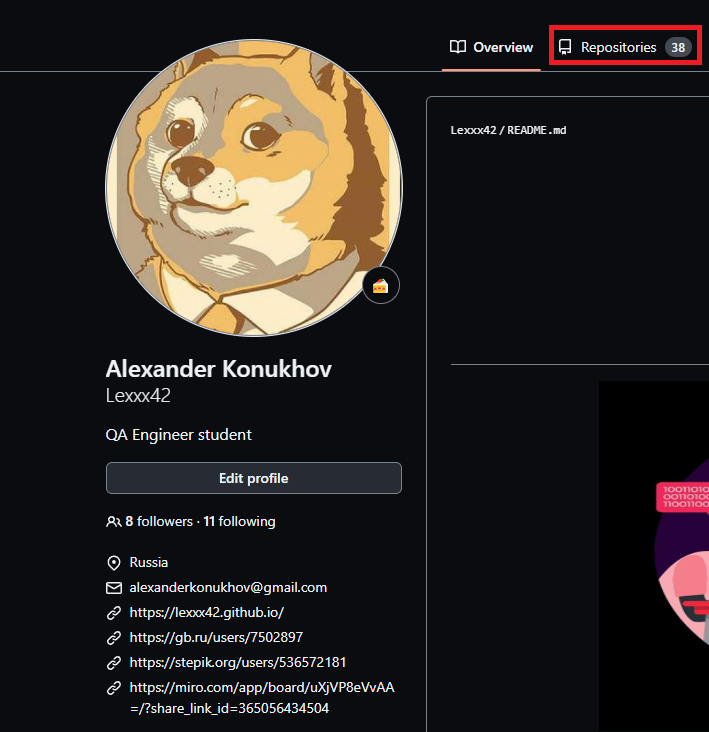

3. Нажать на кнопку "New".

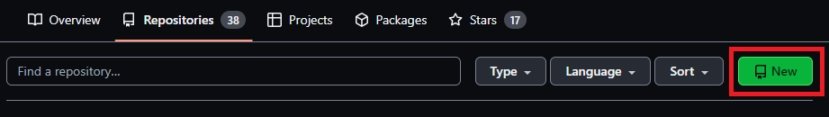

3. Заполнить обязательные поля. Не забываем добавить `README.md` и `.gitignore` (Python).

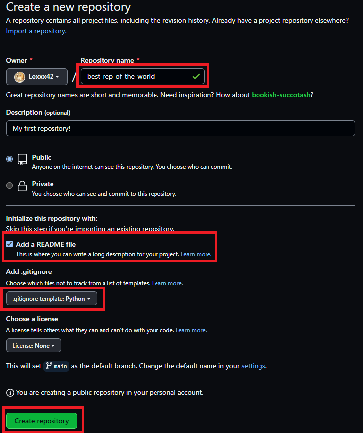

4. Нажать кнопку "Create repository".

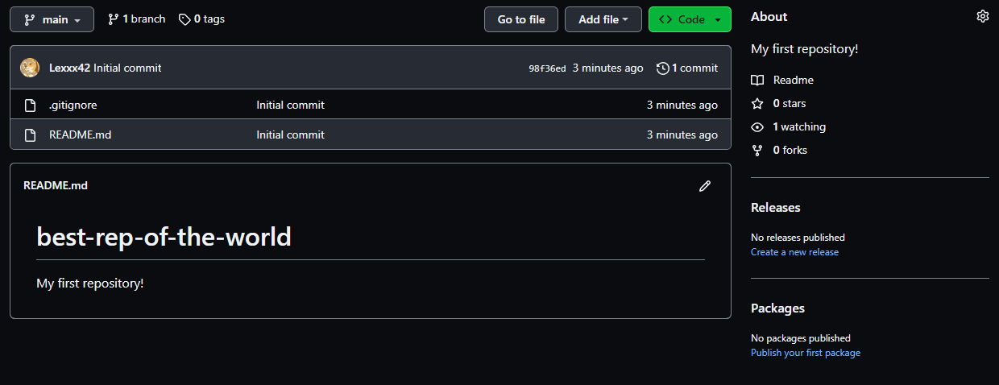

### Клонирование удалённого репозитория в локальный

1. Открыть PyCharm.

2. Нажать "File", выбрать "New Project...".

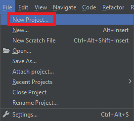

3. Заполнить форму создания проекта. Обязательно указать виртуальное окружение и интерпретатор Python.

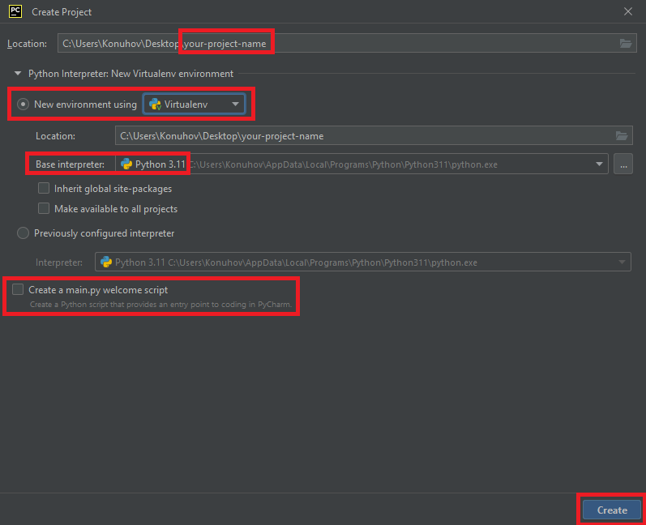

4. Нажать "Create".

5. Нажать "Terminal" в нижней панели PyCharm. Должно отображаться название созданного проекта в круглых скобках. Если
   отображается ошибка, иожно погуглить решение или переключиться на другой терминал. Если у вас не отображается ошибка
   можно пропустить следующие 2 шага.

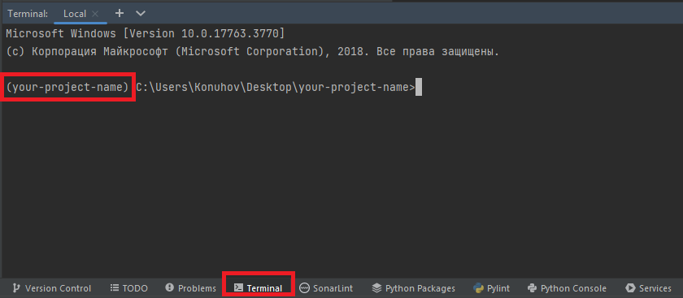

6. Чтобы сменить терминал по умолчанию (powershell) на cmd нажать "File" -> "Settings" -> ввести в поле поиска "
   terminal" -> выбрать настройки терминала -> в выпадающем списке выбрать терминал cmd -> OK.

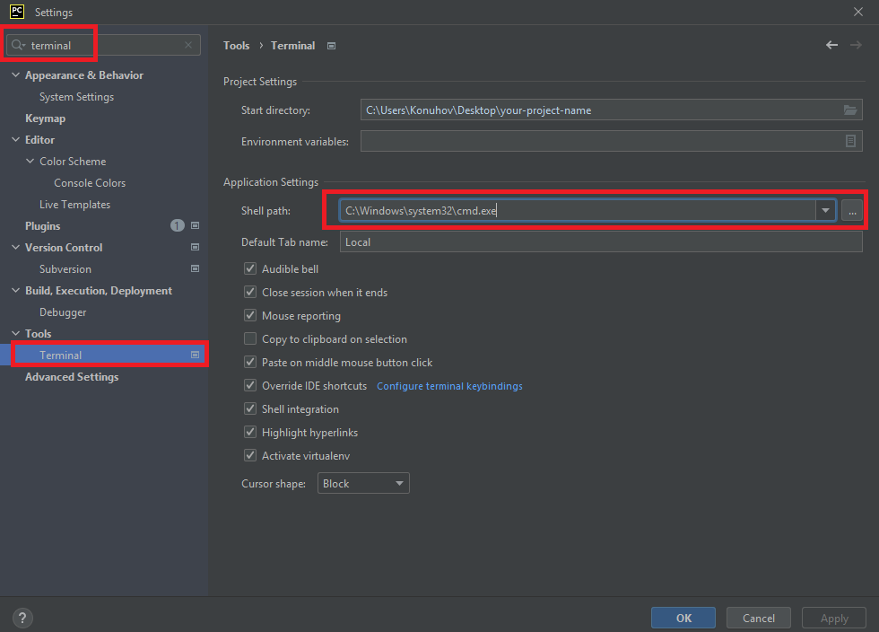

7. Если у вас не отображается терминал как на изображении в шаге 5 закройте PyCharm и откройте его заново.
8. Зайти на страницу GitHub своего репозитория -> Нажать на кнопку "Code" -> Скопировать HTTPS адрес репозитория.

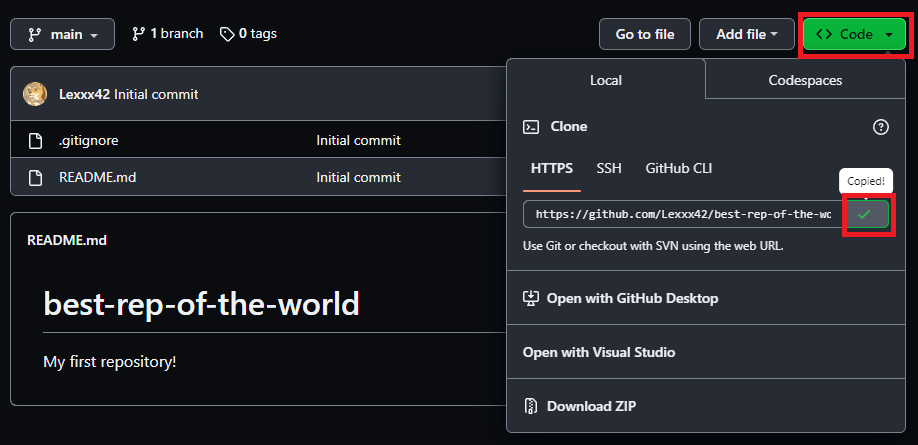

9. Открыть таб "Terminal" в нижней панеле PyCarm -> Ввести команду:

```shell
git clone https://github.com/[your-username]/best-rep-of-the-world.git
```

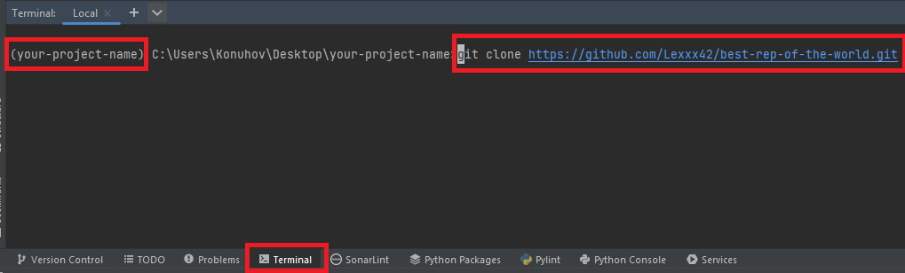

10. Нажать Enter. Скопируются файлы с удалённого репозитория. Проект будет выглядеть следующим образом:

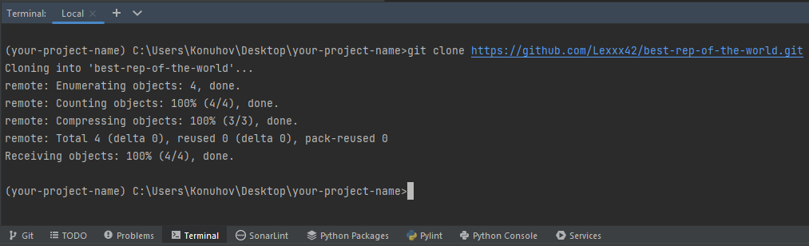

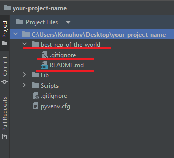

Как видно, скопировался проект с удалённого репозитория внутрь локального. Склонировались .gitignore и README.md
файлы, которые были внутри удалённого репозитория.
