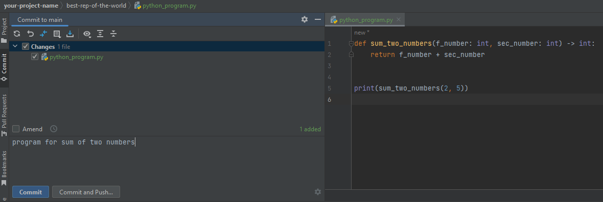

# Основные команды git

## Разберем самые важные команды git, которые используются постоянно:

+ коммиты;
+ создание веток;
+ переключения между ветками;
+ пул реквесты;
+ слияния веток;
+ разрешение конфликтов.

### Создание веток

Работать будем в PyCharm. Использовать консольные команды не будем, разработчики постарались сделать интуитивно понятный
интерфейс для работы с системой контроля версий, которым грех не воспользоваться. Но знать консольные команды
необходимо, это пригодится в работе с ОС без графического интерфейса.

+ Итак, посмотрим на первоначальное состояние нашего репозитория:


+ Отделим новую ветку от ветки main. Для этого переключимся на таб Git в нижней панели PyCharm -> ПКМ на main.


+ В выпадающем меню выбираем пункт "New Branch from 'main'...".

+ Вводим имя нашей новой ветки и нажимаем кнопку "Create".


+ Все изменения принято вносить в главную ветку через слияния второстепенных. К тому же этот механизм позволяет работать
  с репозиторием одновременно нескольким разработчикам. Убеждаемся, что мы действительно перешли на новую ветку: в
  правом нижнем углу PyCharm отображается текущая активная ветка, в панели Git, можно ввести консольную команду:

```shell
git branch
```

### Создадим нашу первую программу на языке Python

+ ПКМ по имени репозитория -> New -> Python File.


+ Я назвал свой новый файл `python_program`, вы можете назвать его как угодно. Но есть нюансы, с которыми будет лучше,
  если вы сами столкнетесь. Далее IDE спросит добавить ли файл в отслеживаемые. Соглашаемся.


+ Обратите внимание, что файл сейчас выделяется зелёным цветом.


Это значит, что это новый контент, которые ещё не зафиксирован.

+ Давайте зафиксируем новое изменение нашего репозитория в новой ветке. Говорят "закоммитимся".
+ Перейдем во вкладку "Commit" в левом сайдбаре IDE -> Отметим изменение, которое мы хотим зафиксировать в чекбоксе ->
  нашишем адекватное сообщение о коммите (принято писать осмысленные сообщения на английском языке) -> Нажать кнопку "
  Commit".


+ Обратите внимание, что файл перестал выделяться зелёным цветом. Это заначит, что изменения сохранены.

+ Напишем классическую программу о приветствии мира внутри файла `python_program.py`.

```python
def hello_world():
    print('Hello World!')


hello_world()

```


+ Сразу заострим внимание на нескольких вещах:
    + Пропущенные строчки. Позже вы познакомитесь с особенностями языка Python и правилами написания кода. Пока
      используйте автоформатирование, которое предлагает IDE PyCharm. Можете посмотреть в настройках комбинацию клавиш
      для своей машины.

      

    + Если у вас установлен интерпретатор Python, то подсвечивается синтаксис языка.
    + Скрипт можно запустить используя сочетание клавиш или нажав на зеленый треугольник на любой из панелей открытого
      файла.

      

      

+ Закоммитим изменения.


+ Отправим изменения на удалённый репозиторий.
+ В нижней панели клик на таб Git -> ПКМ на текущей ветке `first_pytho_program` -> Push... -> Push.


+ В этот момент git может попросить вас представиться ему (от чьего имени будут отправленны данные, вводите актуальную
  почту и своё настоящее имя на английском языке. Так другие разработчики смогут идентифицировать, кому принадлежит
  код, - это очень важно.), PyCharm может попросить у вас авторизоваться в GitHub.
+ Можно убедиться, что изменения были отправлены в удаленный репозиторий.
    + Отроем наш репозиторий.

  

    + Выберем другую ветку, кликнув на "2 branches" или на выпадающий список main.

  

    + Выберите ветку, в которой вы писали код. У меня это `firs_python_program`.

  

    + Посмотрите код в файле `puthon_program.py` кликнув по названию.

  

### Пул-реквест, разрешение конфликтов

+ Переключимся на ветку main. В нижней панели клик на таб Git -> ПКМ main -> Checkout.
+ Как видите, никаких изменений в этой ветке нет.
+ Давайте создадим точно такой же файл и другую программу внутри него.

```python
def sum_two_numbers(f_number: int, sec_number: int) -> int:
    return f_number + sec_number


print(sum_two_numbers(2, 5))

```


Эта программа выводит в консоль сумму двух чисел.


+ Закоммитим изменения и запушим их в удалённый репозиторий.




+ К этому моменту у нас есть 2 ветки в удалённом репозитории, с одинаковым файлом внутри и разным его содержанием.
+ Попробуем сделать пулл-реквест.
    + Открыть репозиторий.

      

    + Нажать кнопку "Compare & pull request".

      

    + Нажать "Create pull request".

      

    + Возникли конфликты при слиянии веток. Сейчас мы их разрешим в GitHub. Этим можно заняться и в IDE, где вам больше
      нравится. Обязательно попробуйте это сделать самостоятельно в разных средах.
    + Нажать "Resolve conflicts".

      

    + Смысл тут такой: GitHub отображает нам участок кода, где возник конфликт и предлагает решить, какой код мы
      оставим. Остальное нужно удалить. Решение будет примерно таким:

      

    + Станет доступна кнопка пометки конфликта как разрешенного, она появится в правой верхней части окна. Я для
      удобства поместил ее рядом.
    + Не будем сохранять изменения и попробуем теперь разрешить конфликт в IDE PyCharm.
        + Убеждаемся, что мы находимся на ветке main или переключаемся на неё.
        + В нижней панели нажимаем на таб "Git" -> ПКМ на второй ветке -> Merge '[имя_ветки]' into 'main'.

          

        + Появится окно разрешения конфликтов.

          

        + Клик "Merge...".
        + Откроется окно сравнения кода из разных веток: слева - main, справа - first_python_program и результат слияния
          ветов по центру. Принимаем изменения нажимая >>, отменяем изменения нажимая X.

          

        + Когда конфликты будут разрешены PyCharm подскажет об этом всплывающим уведомлением.

          

        + Нажать Apply, чтобы изменения вступили в силу.
        + Закоммитим слияние и запушим изменения в main.
        + Теперь, когда мы посмотрим на графическое представление изменений версий нашего репозитория, мы убедимся, что
          пуш прошел успешно и удалённый репозиторий принял изменения.

          

        + Зайдем на GitHub - увидим, что наш пул-реквест успешно закрыт. Ветки объединены в одной main.

          

Мы познакомились с наиболее часто используемыми командами git.
