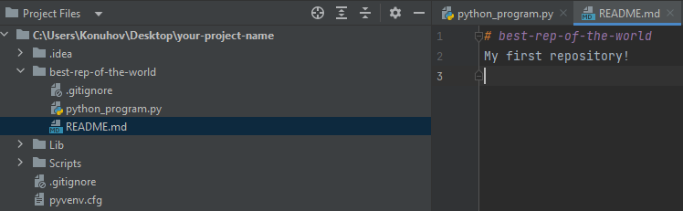

# Файл README.md и разметка Markdown

`README.md` — это файл в репозитории GitHub, который служит файлом документации для репозитория. Он написан в формате
Markdown и предоставляет информацию о назначении репозитория, инструкции по установке, примеры использования и любую
другую соответствующую информацию.

Файл `README.md` важен, потому что он помогает пользователям понять назначение и использование репозитория. Он также
предоставляет важную информацию, которая может помочь пользователям быстро и легко начать работу с репозиторием. Кроме
того, наличие хорошо написанного файла `README.md` может помочь привлечь участников в репозиторий и улучшить совместную
работу.

Мы создали такой файл сразу же при создании репозитория.

## Написание содержания для вашего файла README.md

Содержимое вашего файла `README.md` должно включать следующую информацию:

- Название: название вашего проекта или репозитория.
- Описание: краткое описание того, что делает ваш проект или репозиторий.
- Оглавление: список разделов в вашем файле `README.md`.
- Установка: Инструкции по установке и настройке вашего проекта или репозитория.
- Использование: Инструкции по использованию вашего проекта или репозитория.
- Участие: рекомендации о том, как внести свой вклад в ваш проект или репозиторий. (Опцинально)
- Лицензия: информация о лицензии вашего проекта или репозитория.

Вы можете использовать синтаксис Markdown для форматирования контента и добавления заголовков, списков, изображений,
ссылок и других элементов.

Я перевел на русский язык удобную и информативную инструкцию по применению
разметки [Markdown](https://github.com/Lexxx42/Markdown-Cheatsheet) специально для тех, кому комфортнее читать
актуальную документацию на родном языке. Обязательно советую ознакомиться с ней или другими источниками.

## Предварительный просмотр и редактирование файла README.md

Вы можете предварительно просмотреть файл `README.md`, нажав кнопку «Предварительный просмотр» в редакторе GitHub. Это
покажет, как будет выглядеть файл при отображении в Markdown. Вы также можете отредактировать файл, нажав кнопку
«Редактировать». PyCharm поддерживает редактирование и отображение файлов с разметкой Markdown.

## Внесение изменений в файл README.md

После внесения изменений в файл `README.md` вам необходимо зафиксировать изменения в своем репозитории. Для этого
нажмите на кнопку «Зафиксировать изменения».

## Использование файла README.md

Теперь ваш файл `README.md` будет отображаться на главной странице вашего репозитория. Он предоставит важную информацию
о вашем проекте или репозитории пользователям, которые посещают ваш репозиторий. Вы также можете включить ссылку на
файл `README.md` в документацию вашего проекта или на веб-сайт.

## Ознакомся с оформлением личного `README.md` файла для профиля GitHub.

Для примера, можете посмотреть на мой профиль [Lexxx42](https://github.com/Lexxx42)
Можно взять код его оформления за основу и изменить по своему вкусу или ознакомиться со статьёй по
оформлению [Оформляем README-файл профиля на GitHub](https://habr.com/ru/post/649363/)

Кроме того, вы можете разместить свой `README.md` в качестве страницы, используя
[Создание сайта GitHub Pages](https://docs.github.com/ru/pages/getting-started-with-github-pages/creating-a-github-pages-site).
Для этого придется перевести язык разметки Markdown в язык разметки HTML.

Рекомендую для этих целей использовать уже готовые решения:

- [Convert Markdown to HTML](https://markdowntohtml.com/)
- [Markdown to HTML](https://codebeautify.org/markdown-to-html)

Я надеюсь, что это поможет вам приступить к созданию и использованию файла `README.md` в своих репозиториях GitHub.
