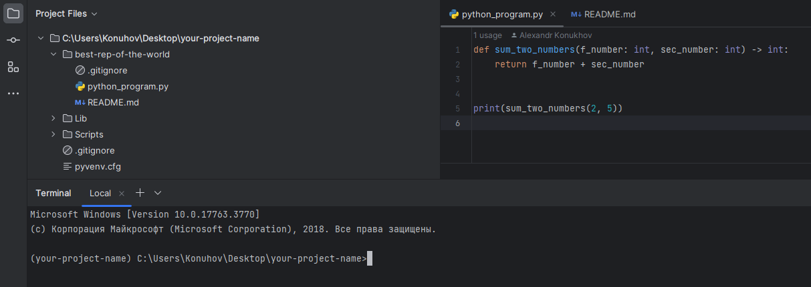
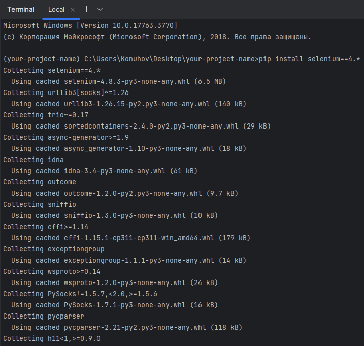
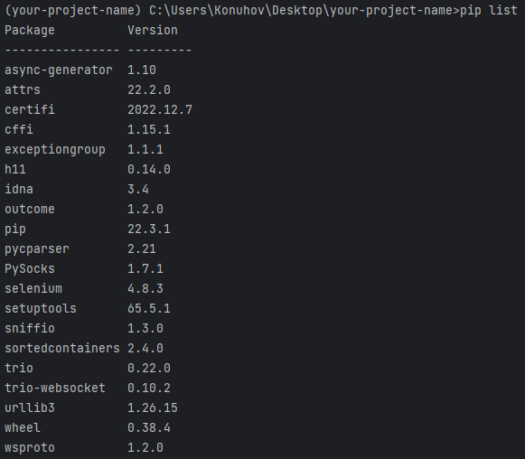
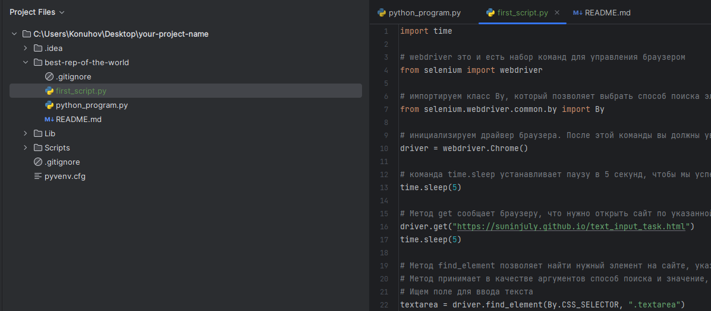
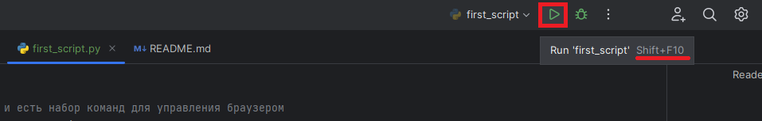
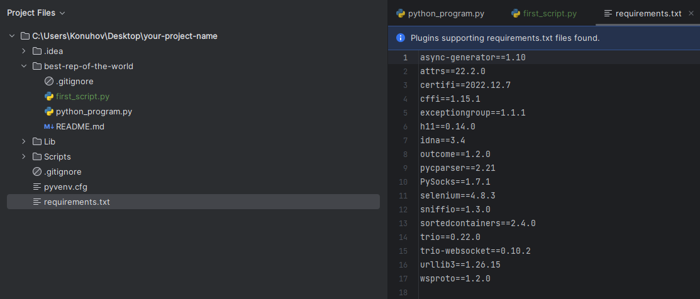
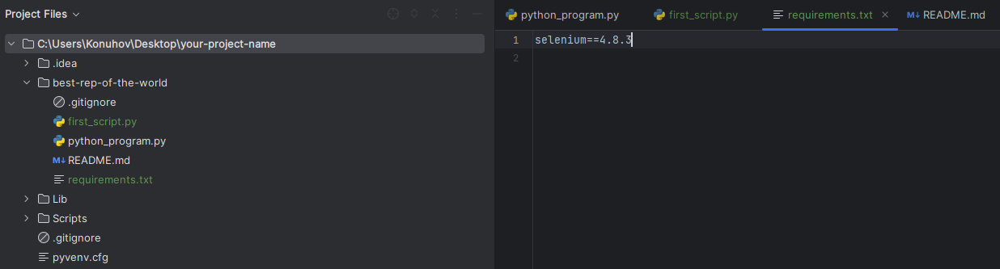
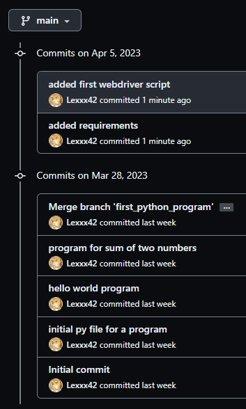

# Настройка первого запуска браузера с помощью Selenium WebDriver

## Прежде всего, в нашем окружении должен быть интерпретатор Python

Установите версию 3.11.2
[Python](https://www.python.org/downloads/)

Мы продолжим работу с нашим ранее созданным репозиторием best-rep-of-the-world, который мы создали в части знакомства с
системой контроля версий Git.



## Установка Selenium для Python

В виртуальном окружении устанавливаем библиотеку Selenium

```shell
pip install selenium==4.*
```



Можно проверить установку командой

```shell
pip list
```



## Установка драйвера для браузера

В этом курсе мы будем работать с драйвером для Chrome, так как на данный момент это самый популярный браузер, и в первую
очередь следует убедиться, что веб-приложение работает для большинства пользователей.


[statcounter](https://gs.statcounter.com/)

Драйвер для Chrome разрабатывается командой браузера и носит название ChromeDriver. Скачать нужную версию можно с
официального сайта по ссылке: [ChromeDriver](https://chromedriver.chromium.org/)

Подробности по установке ChromeDriver доступны по
ссылке: [Установка драйвера chromedriver для Chrome Selenium](https://selenium-python.com/install-chromedriver-chrome)

## Запуск браузера и первый скрипт

Далее мы создадим скрипт, который открывает базовую веб-страницу и заполняет форму. Чтобы получить более глубокое
понимание каждой команды, мы предлагаем запускать их по одной. Не волнуйтесь, если вы не сразу полностью поймете каждую
команду — мы рассмотрим их более подробно в следующих уроках.

```python
import time

# webdriver это и есть набор команд для управления браузером
from selenium import webdriver

# импортируем класс By, который позволяет выбрать способ поиска элемента
from selenium.webdriver.common.by import By

# инициализируем драйвер браузера. После этой команды вы должны увидеть новое открытое окно браузера
driver = webdriver.Chrome()

# команда time.sleep устанавливает паузу в 5 секунд, чтобы мы успели увидеть, что происходит в браузере
time.sleep(5)

# Метод get сообщает браузеру, что нужно открыть сайт по указанной ссылке
driver.get("https://suninjuly.github.io/text_input_task.html")
time.sleep(5)

# Метод find_element позволяет найти нужный элемент на сайте, указав путь к нему. Способы поиска элементов мы обсудим позже
# Метод принимает в качестве аргументов способ поиска и значение, по которому мы будем искать
# Ищем поле для ввода текста
textarea = driver.find_element(By.CSS_SELECTOR, ".textarea")

# Напишем текст ответа в найденное поле
textarea.send_keys("get()")
time.sleep(5)

# Найдем кнопку, которая отправляет введенное решение
submit_button = driver.find_element(By.CSS_SELECTOR, ".submit-submission")

# Скажем драйверу, что нужно нажать на кнопку. После этой команды мы должны увидеть сообщение о правильном ответе
submit_button.click()
time.sleep(5)

# После выполнения всех действий мы должны не забыть закрыть окно браузера
driver.quit()
```



Запустите скрипт любым доступным способом (запуск из терминала, сочетанием клавиш, через UI).



Откроется окно браузера, контроллируемое средствами автоматизации.
Пронаблюдайте за работой скрипта и затем еще раз проанализируйте код.

## Зависимости

Добавим файл `requirements.txt`.
Этот файл отвечает за зависимости, используемые в репозитории.

Чтобы экспортировать зависимости в такой файл можно воспользоваться командой:

```shell
pip freeze > requirements.txt
```



Как видите, в файл `requirements.txt` добавились все зависимости нашего проекта. Однако не принято в таком файле
оставлять зависимости нашей единственной библиотеки. Так как мы использовали только библиотеку `selenium==4.8.3`, а
остальные зависимости были установлены автоматически для обеспечения ее работы, то мы в файле оставим только ее.



Обратите внимание на два момента:

1. Необходимо перенести файл `requirements.txt` в папку репозитория.
2. Последняя строчка в файле `requirements.txt` должна быть пустой (загуглите почему).

Сохраняем изменения в репозитории коммитами, пушим в удалённый репозиторий.

Наша история коммитов в репозитории должна выглядеть примерно следующим образом:


