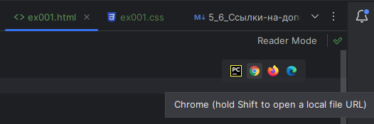
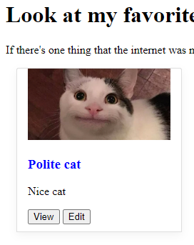
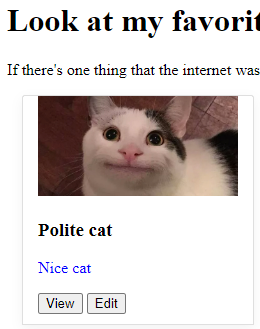
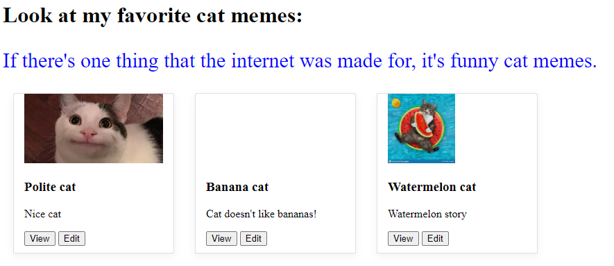
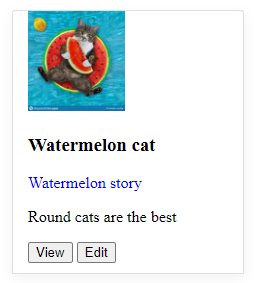
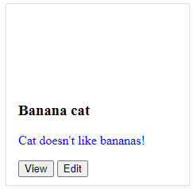
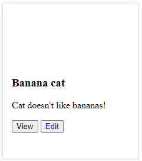

# Практика в написании селекторов

## Задание: поиск по тегу

Откройте страницу с [блогом](http://suninjuly.github.io/blog_example.html) в браузере в инкогнито режиме. Затем откройте
консоль разработчика - вкладка Elements. Введите в строку поиска тег div.
Сколько элементов было найдено?
<details>
  <summary>Правильный ответ</summary>

+ 7

</details>

## Задание: подбор селекторов 1

Для страницы [Cats album](http://suninjuly.github.io/cats.html) сопоставьте селектор для поиска элемента, содержащего
текст "If there's one thing..", и тип селектора.

1. `#moto`
2. `article`
3. `[title="one-thing"]`
4. `[name="moto"]`
5. `.lead`
6. `article.text-muted.lead`

> Поиск по ID, Поиск по name, Поиск по attribute, Поиск по составному CSS-селектору, Поиск по tag, Поиск по class

| CSS selector              | Type of search |
|---------------------------|----------------|
| `#moto`                   |                |
| `article`                 |                |
| `[title="one-thing"]`     |                |
| `[name="moto"]`           |                |
| `.lead`                   |                |
| `article.text-muted.lead` |                |

<details>
  <summary>Правильный ответ</summary>

| CSS selector              | Type of search                    |
|---------------------------|-----------------------------------|
| `#moto`                   | Поиск по ID                       |
| `article`                 | Поиск по tag                      |
| `[title="one-thing"]`     | Поиск по attribute                |
| `[name="moto"]`           | Поиск по name                     |
| `.lead`                   | Поиск по class                    |
| `article.text-muted.lead` | Поиск по составному CSS-селектору |

</details>

## Задание: иерархия элементов в веб-странице

Откройте страницу [Cats album](http://suninjuly.github.io/cats.html). Откройте консоль разработчика и вкладку Elements в
ней. Сопоставьте правильно селекторы элементов на странице и их роль в рамках семейного древа HTML-страницы.

1. `div.card-body`
2. `p.card-text`
3. `div.card`

> потомок для "div.col-sm-4", дочерний элемент для "div.card-body", родитель для "div.card-body"

| CSS selector    | Inheritance |
|-----------------|-------------|
| `div.card-body` |             |
| `p.card-text`   |             |
| `div.card`      |             |

<details>
  <summary>Правильный ответ</summary>

| CSS selector    | Inheritance                          |
|-----------------|--------------------------------------|
| `div.card-body` | потомок для "div.col-sm-4"           |
| `p.card-text`   | дочерний элемент для "div.card-body" |
| `div.card`      | родитель для "div.card-body"         |

</details>

## Задание: поиск потомка

Откройте страницу [Cats album](http://suninjuly.github.io/cats.html). Откройте консоль разработчика и вкладку Elements в
ней. Напишите минимально достаточный CSS-селектор, который найдет элемент с картинкой серьезного кота (Serious cat). Для
поиска подходящего элемента в каталоге картинок используйте родительский элемент `div.col-sm-4` вместе с
псевдо-классом `:nth-child(n)`, чтобы выбрать n-й по счету элемент, а также селектор для картинки по тегу `img`. При
написании этого селектора не надо использовать символ `>`, т.к. это задача на поиск потомка без использования дочерних
элементов. Для решения достаточно тех селекторов, которые уже указаны в задании.

Пожалуйста, не используйте селекторы, которые генерирует браузер по кнопке "скопировать css селектор" или расширения.
Зачастую они строят полный путь, начиная от `body` — а это очень нестабильный селектор, писать такие в своем коде это
плохая практика. При малейшем изменении структуры страницы все ваши селекторы потеряют актуальность.

Не используйте в синтаксисе квадратные скобки — конструкции вида `[class="stepic"]`.

<details>
  <summary>Правильный ответ</summary>

+ Решений у задачи много, если у вас получилось выбрать элемент и он единственный, то у вас все правильно получилось.
+ Вариант правильного решения: `div.col-sm-4:nth-child(2) img`

</details>

## Задание: подбор селекторов 2

Отметьте те селекторы, которые позволят найти только элемент с текстом "Lenin cat" на
странице [Cats album](http://suninjuly.github.io/cats.html). Вы можете вводить приведенные здесь примеры селекторов в
поиске в консоли разработчика, если составление сложных селекторов пока вызывает у вас затруднение.

+ `#politic`
+ `p:nth-child(3)`
+ `.card-body:nth-child(3) p`
+ `[data-name="Vladimir"]`
+ `.col-sm-4:nth-child(3) p`
+ `[name="Vladimir"]`

<details>
  <summary>Правильный ответ</summary>

+ `#politic`
+ `[data-name="Vladimir"]`
+ `.col-sm-4:nth-child(3) p`

</details>

## Задание: подбор селекторов 3

Lenin cat продолжает скрываться. Снова отметьте только те уникальные селекторы, которые позволят найти элемент,
содержащий текст "Lenin cat" на странице [Cats album](http://suninjuly.github.io/cats.html). Теперь набор правильных и
неправильных селекторов стал другим.

> Обратите внимание: если селектор находит несколько элементов, то он не подходит в качестве ответа на эту задачу.

+ `.card-text`
+ `.lenin-cat`
+ `.card-text.lenin-cat`
+ `[text="Lenin cat"]`
+ `.lenin_cat`

<details>
  <summary>Правильный ответ</summary>

+ `.lenin-cat`
+ `.card-text.lenin-cat`

</details>

## Задание: поиск по XPath

[xpath_examples](http://suninjuly.github.io/xpath_examples)

У нас тут на странице кошмар авто-тестера: 8 одинаковых кнопок. Подберите такой XPath-селектор, чтобы выбрать только
кнопку с текстом Gold. Используйте XPath-запрос с методом text().

<details>
  <summary>Правильный ответ</summary>

+ `//button[contains(text(), "Gold")]`

</details>

## Задание ex001. ID-селекторы (папка examples)

CSS-селекторы используют фронтенд-разработчики, чтобы выбрать элементы на странице и применить к ним определенные стили,
то есть правила для отрисовки. В автотестах мы пишем селекторы по тем же самым правилам, чтобы найти нужные нам элементы
и произвести с ними какие-то действия с помощью Selenium WebDriver.

Откройте файл `ex001.html`. Для этого можно открыть файл в PyCharm и нажать иконку браузера.



Попробуйте написать селектор, который найдет элемент с заголовком в карточке первого кота.
Используйте для этого ID элемента.

Результат должен быть следующим:



Вместо текста "ваш селектор здесь" в файле `ex001.css` напишите селектор:

```css
ваш селектор здесь
{
    color:blue;
}
```

<details>
  <summary>Правильный ответ</summary>

+ `#polite`

</details>

## Задание ex002. Селектор с атрибутом data-type (папка examples)

Попробуйте написать селектор, который найдет элемент с текстом-описанием к карточке первого кота. Используйте
специальный атрибут data-typе.

Обратите внимание, что выбрать нужно только один элемент!

Результат должен быть следующим:



<details>
  <summary>Правильный ответ</summary>

+ `.card-body > [data-type]`

</details>

## Задание ex003. Селектор класса (папка examples)

Подберите селектор для текста в подзаголовке страницы, и добавьте ему синий цвет. Можно сделать это по-разному, но
попробуйте использовать здесь класс элемента. Будьте внимательны и подберите уникальный селектор, чтобы по нему
однозначно находился только один элемент.

Результат должен быть следующим:



<details>
  <summary>Правильный ответ</summary>

+ `p.text`

</details>

## Задание ex004. Составной селектор из нескольких классов (папка examples)

Структура страницы еще немного поменялась. Подберите селектор к первому абзацу текста на карточке с арбузным котом (это
последняя карточка). Текст который должен стать синим - "Watermelon story". Будьте внимательны и выберите уникальный
селектор, чтобы синим стал один и только один элемент!

Результат должен быть следующим:



<details>
  <summary>Правильный ответ</summary>

+ `.watermelon > p.description`

</details>

## Задание ex005. Составной селектор (папка examples)

Подберите селектор к описанию второй карточки с бананом и котом (элемент с текстом "Cat doesn't like bananas!"). Будьте
внимательны и подберите уникальный селектор, чтобы по нему однозначно находился только один элемент.

Результат должен быть следующим:



<details>
  <summary>Правильный ответ</summary>

+ `.banana [data-type]`

</details>

## Задание ex006. Иерархическая структура + порядок элементов

С текстом вроде бы разобрались! Давайте теперь поиграем шрифтами на кнопках. Найдите вторую кнопку (она с текстом **"
Edit"**) на карточке с котом и бананом. Напишите для неё уникальный селектор, так, чтобы никакие другие элементы не
выделялись.



<details>
  <summary>Правильный ответ</summary>

+ `[name="banana"] > .btn-group > .btn:nth-child(2)`

</details>
