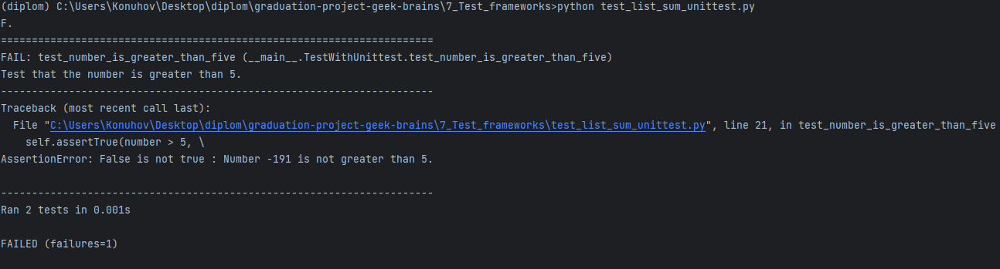
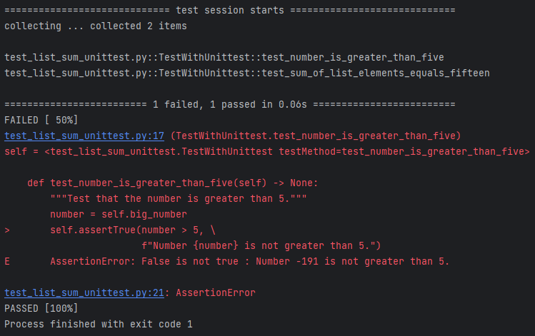
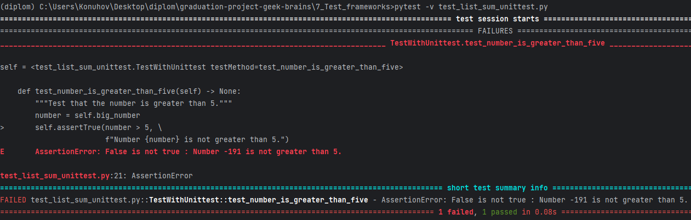
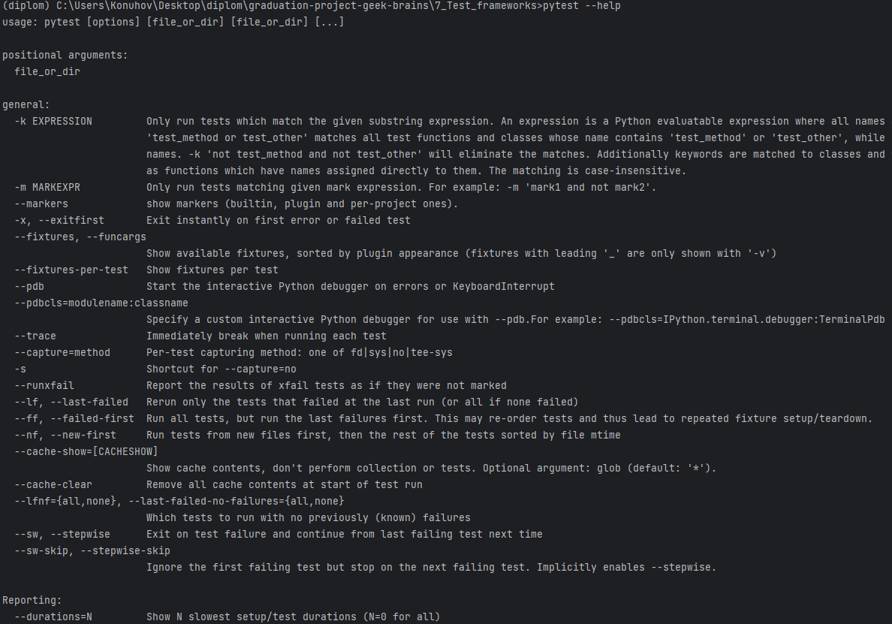
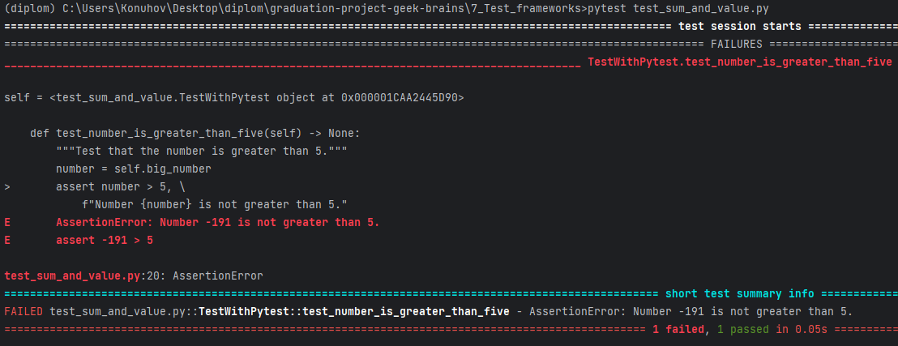

# Тестирование с помощью PyTest

## PyTest — преимущества и недостатки

Установить PyTest можно использовав команду:

```shell
pip install pytest
```

Мы будем использовать версию 7.3.1. Её можно установить командой:

```shell
pip install pytest==7.3.1
```

Или подтянуть зависимости из файла `requirements.txt`:

```shell
pip install -r requirements.txt
```

Рассмотрим преимущества использования PyTest:

1. Простой и удобный в использовании: PyTest разработан, чтобы быть интуитивно понятным и простым в использовании, с
   простым синтаксисом для определения тестов и фикстур.
2. Мощные фикстуры: фикстуры в PyTest — это мощный инструмент для настройки тестовых данных и ресурсов, и их можно
   использовать в тестах и наборах тестов.
3. Полная отчетность: PyTest предоставляет подробные и исчерпывающие отчеты о результатах тестирования, включая сводки,
   информацию о трассировке и продолжительность тестирования.
4. Параметризованное тестирование. С помощью PyTest вы можете легко выполнять параметризованное тестирование, когда одна
   тестовая функция запускается с несколькими наборами входных данных.
5. Система плагинов: PyTest имеет богатую систему плагинов, которая предоставляет широкий спектр функций, таких как
   параллельный запуск тестов, создание отчетов в формате HTML и многое другое.
6. Поддерживает как модульное, так и функциональное тестирование: PyTest поддерживает как модульное, так и
   функциональное тестирование, что делает его универсальным инструментом для тестирования всех типов кода Python.
7. Лучшее обнаружение тестов: PyTest обеспечивает лучшее обнаружение тестов, чем unittest, который может автоматически
   находить и запускать тесты в каталоге или модуле, не требуя явных тест-кейсов.

В целом, PyTest — это мощный и гибкий инструмент тестирования, который обеспечивает множество преимуществ по сравнению с
unittest, включая более простой синтаксис, более мощные инструменты, улучшенную отчетность и большую расширяемость.

Хотя у PyTest есть много преимуществ, есть и некоторые недостатки, которые следует учитывать при его использовании:

1. Кривая обучения: PyTest имеет более обширный набор функций и требует некоторых дополнительных знаний по сравнению со
   встроенным модулем unittest. Это может затруднить обучение новичков.
2. Настройка: гибкость PyTest может быть палкой о двух концах. Его широкие возможности настройки могут затруднить для
   команд поддержание согласованности в наборах тестов.
3. Управление плагинами: PyTest имеет большое количество доступных плагинов, что может быть как силой, так и слабостью.
   Хотя они предлагают множество полезных функций, управление плагинами может занимать много времени, и может быть
   сложно найти и выбрать правильный плагин для ваших нужд.
4. Отладка: отладка может быть сложной задачей в PyTest из-за его модульной природы. Иногда может быть сложно
   определить, какой плагин или хук вызывает проблему, что приводит к увеличению времени отладки.
5. Накладные расходы: дополнительные функции и гибкость PyTest сопряжены с некоторыми накладными расходами. В некоторых
   случаях тесты PyTest могут выполняться дольше, чем тесты, написанные с использованием более простых сред
   тестирования.

При рассмотрении вопроса о том, является ли PyTest правильным выбором для вашего проекта, важно взвесить эти недостатки
и преимущества.

## Отвлекемся на фиксацию пакетов

Файл `requirements.txt` — это текстовый файл, в котором вы можете перечислить необходимые пакеты Python с их версиями.
Распространенной практикой является использование файла `requirements.txt`, чтобы сделать ваш проект более переносимым и
чтобы любой, кто хочет запустить ваш код, могли легко установить все зависимости.

Когда вы создаете файл `requirements.txt`, вы можете перечислить все пакеты Python, необходимые для запуска вашего
проекта. Вы можете указать версию каждого пакета или использовать диапазоны версий, чтобы указать, что любая версия в
пределах определенного диапазона будет приемлемой.

Чтобы создать файл requirements.txt для вашего проекта Python, выполните следующие действия:

1. Откройте командную строку или окно терминала.
2. Перейдите в каталог вашего проекта.
3. Убедитесь, что ваша виртуальная среда активна.
4. Выполните следующую команду, чтобы создать файл `requirements.txt`:

```shell
pip freeze > requirements.txt
```

Это создаст новый файл с именем `requirements.txt` в каталоге вашего проекта. Файл будет содержать список всех
установленных пакетов и их версий.

Если вы используете виртуальные среды, рекомендуется создать новый файл требований после установки нового пакета или
обновления существующего. Это гарантирует наличие актуального списка зависимостей, которые можно легко установить в
других средах.

Чтобы установить зависимости из файла `requirements.txt` нужно использовать команду:

```shell
pip install -r requirements.txt
```

Все необходимые зависимости установлены одной командой!

## PyTest: правила запуска тестов

Мы кратко остановимся на важнейших функциях запуска тестов с использованием PyTest. Когда мы
инициируем команду `pytest`, средство запуска тестов соберет все тесты для выполнения на основе определенных правил:

+ Если мы выполним команду `pytest` без передачи каких-либо аргументов, средство запуска тестов автоматически выполнит
  поиск тестов в текущем каталоге.
+ В качестве аргумента вы можете передать файл, путь к каталогу или любую комбинацию каталогов и файлов. Например:

```shell
pytest scripts/selenium_scripts
# найти все тесты в директории scripts/selenium_scripts

pytest test_user_interface.py
# найти и выполнить все тесты в файле 

pytest scripts/drafts.py::test_register_new_user_parametrized
# найти тест с именем test_register_new_user_parametrized в указанном файле в указанной директории и выполнить 
```

+ Далее PyTest выполнит рекурсивный поиск по всем вложенным каталогам.
+ Во время поиска PyTest проверяет все каталоги на наличие файлов, которые соответствуют соглашению об
  именах `test_*.py` или `*test.py` (т. е. файлы, которые начинаются с `test_` или заканчиваются на `_test` и имеют
  расширение `.py`).
+ В каждом из этих файлов PyTest идентифицирует тестовые функции на основе следующих правил:
    + PyTest идентифицирует все тесты, которые находятся за пределами классов и имена которых начинаются с `test`.
    + Кроме того, PyTest идентифицирует все тесты в классах, имена которых начинаются с `Test` (и которые не содержат
      метод инициализации) и имена методов которых начинаются с `test`.

С подробностями можно ознакомиться в
[соглашении по обнаружению тестов.](https://docs.pytest.org/en/stable/explanation/goodpractices.html#conventions-for-python-test-discovery)

## PyTest — отчёты

Давайте сравним формат отчётов unittest и PyTest.

### unittest



### PyTest



При выполнении PyTest с флагом -v (verbose, подробный) отчет о тестировании включает дополнительную информацию, в
которой перечислены тесты и их статус прохождения/непрохождения:



Ознакомиться с другими полезными командами и функциями вывода информации можно использовав команду:

```shell
pytest --help
```



## PyTest — как пишут тесты

В отличие от unittest, PyTest не требует использования дополнительных специфических конструкций в ваших тестах.

Мы уже запускали тесты, написанные в unittest стиле с помощью PyTest.
Давайте перепишем их в более простом варианте, который понимает PyTest.

Назовем новый файл `test_sum_and_value.py`

```python
"""Making first test scripts."""


class TestWithPytest:
    """This class provides data for tests."""
    big_number: int = -191
    numbers: list[int] = [1, 2, 3, 4, 5]

    def test_sum_of_list_elements_equals_fifteen(self) -> None:
        """Test that sum of list elements is equal to 15."""
        input_list = self.numbers
        total = sum(input_list)
        assert total == 15, \
            f"The sum of the list {input_list} is incorrect. " \
            f"Expected: 15. Got: {total}."

    def test_number_is_greater_than_five(self) -> None:
        """Test that the number is greater than 5."""
        number = self.big_number
        assert number > 5, \
            f"Number {number} is not greater than 5."

```

Запустим тесты в этом файле:

```shell
pytest test_sum_and_value.py
```


