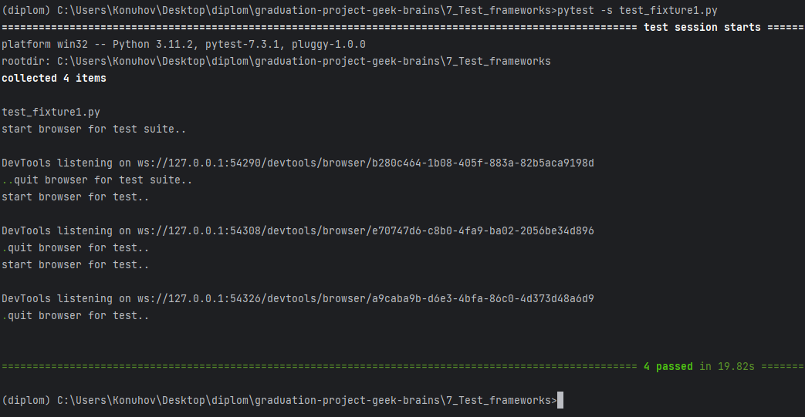

# Использование фикстур в PyTest

## Классические фикстуры (fixtures)

В контексте PyTest фикстуры — это вспомогательные функции для тестов, которые существуют вне самого тестового сценария.

Фикстуры служат различным целям, включая подготовку тестовой среды, очистку тестовой среды и данных после завершения
теста, подключение к базам данных, создание тестовых файлов и подготовку данных в текущей среде с использованием методов
API. Для получения дополнительной информации о фикстурах в самом широком смысле см. статью
в [Википедии](https://en.wikipedia.org/wiki/Test_fixture#Software) на эту тему.

Традиционный подход к использованию фикстур предполагает создание методов настройки и демонтажа в тестовом файле. Вы
можете найти более подробную информацию о том, как использовать эти методы
в [документации PyTest](https://docs.pytest.org/en/latest/how-to/xunit_setup.html).

Фикстуры можно создавать для различных областей, таких как модули, классы и отдельные функции в PyTest. Мы можем создать
фикстуру для инициализации браузера, которую можно использовать в наших тестах. Чтобы избежать нескольких открытых окон
браузера, мы закроем браузер с помощью команды `browser.quit()` после завершения выполнения тестов. Переместив код
инициализации и закрытия браузера в фикстуры, мы можем повторно использовать код в нескольких тестах, не повторяя его
каждый раз.

Чтобы организовать наши тесты, мы сгруппируем их в тестовые наборы, используя классы в качестве контейнеров.

Давайте рассмотрим два примера, иллюстрирующих использование фикстур. Первый пример включает создание экземпляра
браузера и его закрытие только один раз для всех тестов в наборе тестов. Напротив, во втором примере создается браузер
для каждого теста в наборе тестов. Вы можете сохранить приведенный ниже код в файл с именем `test_fixture1.py` и
запустить его с помощью PyTest. Чтобы увидеть вывод команды `print()`, не забудьте использовать параметр `-s`.

```shell
pytest -s test_fixture1.py
```

```python
from selenium import webdriver
from selenium.webdriver.common.by import By

link = "http://selenium1py.pythonanywhere.com/"


class TestMainPage1:

    @classmethod
    def setup_class(cls):
        print("\nstart browser for test suite..")
        cls.browser = webdriver.Chrome()

    @classmethod
    def teardown_class(cls):
        print("quit browser for test suite..")
        cls.browser.quit()

    def test_guest_should_see_login_link(self):
        self.browser.get(link)
        self.browser.find_element(By.CSS_SELECTOR, "#login_link")

    def test_guest_should_see_basket_link_on_the_main_page(self):
        self.browser.get(link)
        self.browser.find_element(By.CSS_SELECTOR, ".basket-mini .btn-group > a")


class TestMainPage2:

    def setup_method(self):
        print("start browser for test..")
        self.browser = webdriver.Chrome()

    def teardown_method(self):
        print("quit browser for test..")
        self.browser.quit()

    def test_guest_should_see_login_link(self):
        self.browser.get(link)
        self.browser.find_element(By.CSS_SELECTOR, "#login_link")

    def test_guest_should_see_basket_link_on_the_main_page(self):
        self.browser.get(link)
        self.browser.find_element(By.CSS_SELECTOR, ".basket-mini .btn-group > a")

```

В консоли видим:



Мы видим, что в первом тест-сьюте браузер запустился один раз, а во втором — два раза.

Запуск каждого теста в отдельном экземпляре браузера считается хорошей практикой, поскольку оставшиеся данные и кеш
предыдущих тестов могут потенциально повлиять на результаты последующих тестов. Такой подход обеспечивает большую
стабильность и надежность при тестировании. Более того, выполнение каждого теста в отдельном экземпляре браузера может
предотвратить влияние проблем, которые могут возникнуть из-за зависания браузера во время одного теста, на другие тесты.

Запуск браузера для каждого теста имеет некоторые недостатки. Каждый запуск и выход из браузера требует времени, что
может увеличить продолжительность тестов. Если вам нужно оптимизировать время выполнения тестов, рекомендуется
использовать другие инструменты, о которых речь пойдет позже.

Как правило, эти фикстуры включаются в тесты, написанные на модульном тесте, и требуют обслуживания. Однако в настоящее
время используются более гибкие фикстуры @pytest.fixture.

## Фикстуры, возвращающие значение

В предыдущем разделе обсуждался традиционный метод создания фикстур, при котором тестовые данные инициализируются и
очищаются в рамках методов setup и teardown. Однако PyTest предоставляет расширенный подход к фикстурам, где их
можно определять глобально, передавать в качестве аргументов тестовым методам и даже включать в себя набор
предварительно созданных фикстур. Этот подход гораздо более гибкий и удобный для работы со вспомогательными функциями, и
мы сейчас рассмотрим его более подробно.

### Возвращаемое значение

Давайте пересмотрим предыдущий пример, используя фикстуры PyTest. Мы можем создать фикстуру с именем `browser`, которая
инициализирует объект WebDriver и возвращает его для использования в тестах. Чтобы определить фикстуру, нам нужно
создать метод с именем `browser` и декорировать его @pytest.fixture. После определения мы можем вызвать фикстуру в
наших тестах, передав ее в качестве параметра. По умолчанию для каждого тестового метода создается фикстура, а это
значит, что для каждого теста будет запускаться отдельный экземпляр браузера.

```shell
pytest -s -v test_fixture2.py
```

```python
import pytest
from selenium import webdriver
from selenium.webdriver.common.by import By

link = "http://selenium1py.pythonanywhere.com/"


@pytest.fixture
def browser():
    print("\nstart browser for test..")
    browser = webdriver.Chrome()
    return browser


class TestMainPage1:
    # вызываем фикстуру в тесте, передав ее как параметр
    def test_guest_should_see_login_link(self, browser):
        browser.get(link)
        browser.find_element(By.CSS_SELECTOR, "#login_link")

    def test_guest_should_see_basket_link_on_the_main_page(self, browser):
        browser.get(link)
        browser.find_element(By.CSS_SELECTOR, ".basket-mini .btn-group > a")

```

## Финализаторы — закрываем браузер

В предыдущем примере вы могли заметить, что мы не включили команду `browser.quit()`.
В результате несколько окон браузера
оставались открытыми после завершения тестов и закрывались только после того, как все тесты были выполнены. Такое
поведение было связано со встроенным приспособлением — сборщиком мусора. Однако, если количество тестов превышает
несколько десятков, оставление нескольких открытых окон браузера может быстро привести к истощению оперативной памяти
системы. Поэтому крайне важно явно закрывать браузеры после каждого теста. Этого можно добиться с помощью финализаторов,
и один из способов реализовать финализатор — использовать ключевое слово `yield` в Python. После завершения теста,
вызвавшего фикстуру, выполнение фикстуры продолжается со строки, следующей за строкой с ключевым словом `yield`.

> test_fixture3.py

```python
import pytest
from selenium import webdriver
from selenium.webdriver.common.by import By

link = "http://selenium1py.pythonanywhere.com/"


@pytest.fixture
def browser():
    print("\nstart browser for test..")
    browser = webdriver.Chrome()
    yield browser
    # этот код выполнится после завершения теста
    print("\nquit browser..")
    browser.quit()


class TestMainPage1:
    # вызываем фикстуру в тесте, передав ее как параметр
    def test_guest_should_see_login_link(self, browser):
        browser.get(link)
        browser.find_element(By.CSS_SELECTOR, "#login_link")

    def test_guest_should_see_basket_link_on_the_main_page(self, browser):
        browser.get(link)
        browser.find_element(By.CSS_SELECTOR, ".basket-mini .btn-group > a")

```

Документация PyTest предлагает альтернативный метод для вызова кода разрыва с использованием встроенной фиксации запроса
и его метода `addfinalizer`. Вы можете обратиться
к [документации](https://docs.pytest.org/en/latest/how-to/fixtures.html#adding-finalizers-directly), чтобы изучить этот
метод.

Вместо того, чтобы записывать данные и очистку памяти в шагах теста, рекомендуется помещать их в фикстуру, чтобы
финализатор выполнялся даже в случае провала теста.

## Область видимости scope

Фикстуры в PyTest могут быть привязаны к определенной области покрытия. Доступные значения для параметра области
действия: «функция», «класс», «модуль» и «сеанс». В зависимости от выбранной области фикстура будет вызываться один раз
для каждой тестовой функции, один раз для каждого тестового класса, один раз для каждого тестового модуля или один раз
для всего тестового сеанса.

Чтобы сэкономить время, мы можем установить область действия фикстуры браузера на «класс», чтобы все тесты из класса
TestMainPage1 могли выполняться в одном и том же браузере.

> test_fixture5.py

```python
import pytest
from selenium import webdriver
from selenium.webdriver.common.by import By

link = "http://selenium1py.pythonanywhere.com/"


@pytest.fixture(scope="class")
def browser():
    print("\nstart browser for test..")
    browser = webdriver.Chrome()
    yield browser
    print("\nquit browser..")
    browser.quit()


class TestMainPage1:

    # вызываем фикстуру в тесте, передав ее как параметр
    def test_guest_should_see_login_link(self, browser):
        print("start test1")
        browser.get(link)
        browser.find_element(By.CSS_SELECTOR, "#login_link")
        print("finish test1")

    def test_guest_should_see_basket_link_on_the_main_page(self, browser):
        print("start test2")
        browser.get(link)
        browser.find_element(By.CSS_SELECTOR, ".basket-mini .btn-group > a")
        print("finish test2")

```

В этом примере браузер запускался только один раз, и тесты выполнялись последовательно в этом браузере. Хотя мы
продемонстрировали это здесь, мы настоятельно рекомендуем запускать отдельный экземпляр браузера для каждого теста,
чтобы повысить стабильность тестов. Для фикстур, которые потребляют много времени и ресурсов (обычно операции с базой
данных), они могут выполняться один раз за сеанс выполнения теста.

## Автоиспользование фикстур

Вы можете указать дополнительный параметр при определении фикстуры, а именно `autouse=True`, что означает, что фикстура
будет автоматически выполняться для каждого теста, не требуя явного вызова.

> test_fixture_autouse.py


Если вы запустите этот код, вы заметите, что фикстура подготовки данных выполняется для каждого теста даже без явного
вызова из-за параметра `autouse=True`. Однако вы должны использовать этот параметр с осторожностью, так как фикстура
будет выполняться для всех тестов. Поэтому рекомендуется использовать его только тогда, когда это необходимо.
