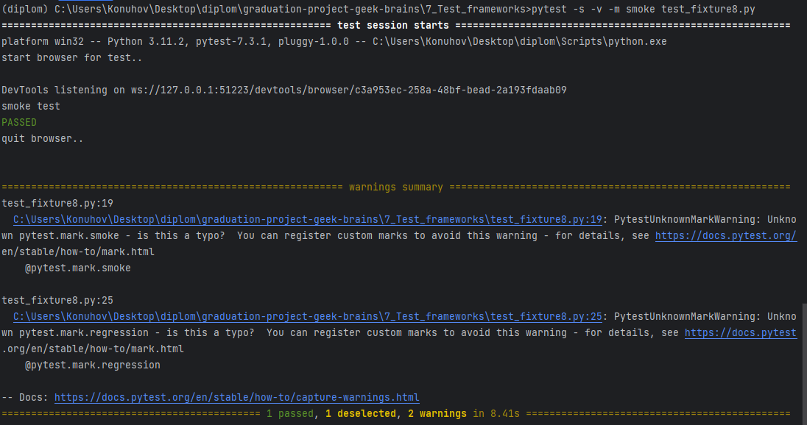
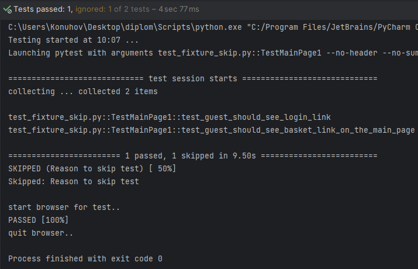
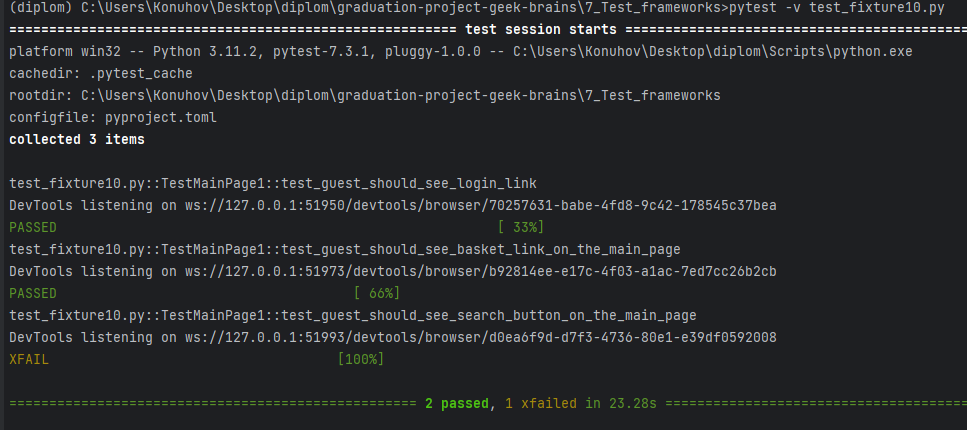
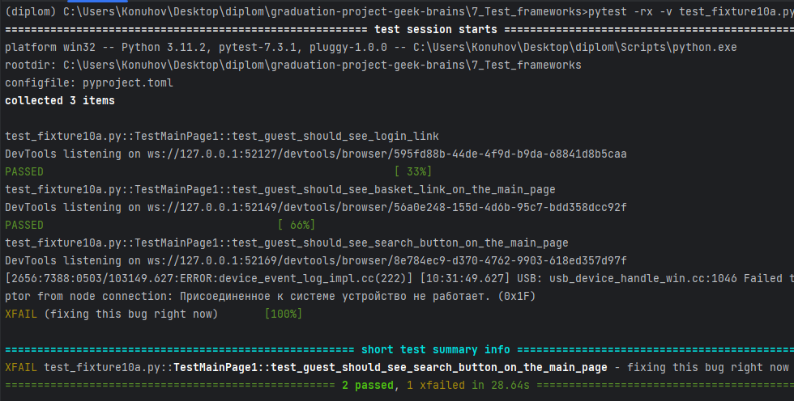
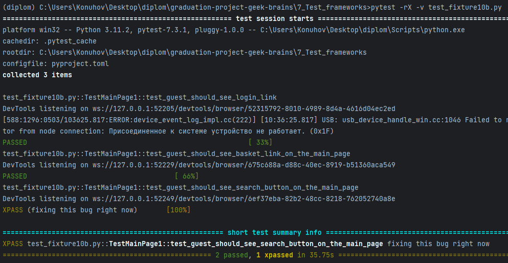

# PyTest — маркировка

## Маркировка тестов часть 1

При работе с большим количеством тестов может быть полезно распределить их по категориям, а не только по именам. Вот где
вступает в действие маркировка тестов. Отмечая тесты определенными категориями, такими как «smoke» для критических
тестов или «regression» для регрессионных тестов, выполняемых перед выпуском, мы можем выборочно запускать тесты на
основе их категории. Кроме того, у нас могут быть тесты, специфичные для определенного браузера, например Internet
Explorer 11, и мы можем захотеть запустить эти тесты только в этом браузере.
PyTest предоставляет тестовую маркировку или метки для
этой цели. Чтобы пометить тест, вы можете использовать декоратор, например @pytest.mark.mark_name, где «mark_name» —
любая выбранная вами строка.

Разделим тесты в одном из предыдущих примеров на smoke и regression.

> test_fixture8.py:

```python
import pytest
from selenium import webdriver
from selenium.webdriver.common.by import By

link = "http://selenium1py.pythonanywhere.com/"


@pytest.fixture(scope="function")
def browser():
    print("\nstart browser for test..")
    browser = webdriver.Chrome()
    yield browser
    print("\nquit browser..")
    browser.quit()


class TestMainPage1:

    @pytest.mark.smoke
    def test_guest_should_see_login_link(self, browser):
        print("smoke test")
        browser.get(link)
        browser.find_element(By.CSS_SELECTOR, "#login_link")

    @pytest.mark.regression
    def test_guest_should_see_basket_link_on_the_main_page(self, browser):
        print("regression test")
        browser.get(link)
        browser.find_element(By.CSS_SELECTOR, ".basket-mini .btn-group > a")
```

Вы можете выполнить тест с нужной меткой, передав параметр `-m`, а затем нужную метку в командной строке.

```shell
pytest -s -v -m smoke test_fixture8.py
```

Должен запуститься только тест с маркировкой smoke.

При этом вы увидите уведомление с предупреждениями:



В последних версиях PyTest настоятельно рекомендуется явно регистрировать метки перед использованием, чтобы избежать
опечаток. Пометка теста несуществующей меткой может привести к тому, что он будет пропущен во время тестов. Вот почему
появляется предупреждение.

## Как регистрировать метки?

Создайте файл `pyproject.toml` в корневой директории вашего тестового проекта и добавьте в файл следующие строки:

```
[tool.pytest.ini_options]

markers = [
    "smoke: marker for smoke tests",
    "regression: marker for regression tests"
]
```

Запустите тесты повторно, предупреждений быть не должно.

Маркировать можно не только методы, но и сразу целые классы. В этом случае маркировка будет применена ко всем тестовым
методам этого класса.

## Маркировка тестов часть 2

### Инверсия

Для выполнения всех тестов, не помеченных как «smoke», можно использовать инверсию.
Выполните следующую команду:

```shell
pytest -s -v -m "not smoke" test_fixture8.py
```

### Объединение тестов с разными маркировками

Чтобы запустить тесты с разными метками с использованием логического ИЛИ, вы можете выполнить следующую команду для
запуска как smoke, так и regression тестов:

```shell
pytest -s -v -m "smoke or regression" test_fixture8.py
```

### Выбор тестов, имеющих несколько маркировок

Предполагая, что есть необходимость запускать дымовые тесты исключительно на Windows 10, мы можем прописать метку win10
в файле `pyproject.toml` и назначить ее соответствующему тесту.

> pyproject.toml

```
[tool.pytest.ini_options]

markers = [
    "smoke: marker for smoke tests",
    "regression: marker for regression tests",
    "win10"
]
```

> test_fixture81.py

```python
import pytest
from selenium import webdriver
from selenium.webdriver.common.by import By

link = "http://selenium1py.pythonanywhere.com/"


@pytest.fixture(scope="function")
def browser():
    print("\nstart browser for test..")
    browser = webdriver.Chrome()
    yield browser
    print("\nquit browser..")
    browser.quit()


class TestMainPage1:

    @pytest.mark.smoke
    def test_guest_should_see_login_link(self, browser):
        browser.get(link)
        browser.find_element(By.CSS_SELECTOR, "#login_link")

    @pytest.mark.smoke
    @pytest.mark.win10
    def test_guest_should_see_basket_link_on_the_main_page(self, browser):
        browser.get(link)
        browser.find_element(By.CSS_SELECTOR, ".basket-mini .btn-group > a")
```

Чтобы запустить только smoke-тесты для Windows 10, нужно использовать логическое И:

```shell
pytest -s -v -m "smoke and win10" test_fixture81.py
```

Должен выполниться тест test_guest_should_see_basket_link_on_the_main_page.

## Пропуск тестов

PyTest предоставляет встроенные маркеры, которые позволяют пропустить тест во время сбора тестов.
Вам не нужно объявлять эти маркеры в `pyproject.toml`.

Чтобы пропустить тест необходимо отметить его как `@pytest.mark.skip`:

> test_fixture_skip.py

```python
import pytest
from selenium import webdriver
from selenium.webdriver.common.by import By

link = "http://selenium1py.pythonanywhere.com/"


@pytest.fixture(scope="function")
def browser():
    print("\nstart browser for test..")
    browser = webdriver.Chrome()
    yield browser
    print("\nquit browser..")
    browser.quit()


class TestMainPage1():

    @pytest.mark.skip(reason="Reason to skip test")
    def test_guest_should_see_login_link(self, browser):
        browser.get(link)
        browser.find_element(By.CSS_SELECTOR, "#login_link")

    def test_guest_should_see_basket_link_on_the_main_page(self, browser):
        browser.get(link)
        browser.find_element(By.CSS_SELECTOR, ".basket-mini .btn-group > a")
```



Хорошей практикой является явное указание причины пропуска теста `@pytest.mark.skip(reason="Reason to skip test")`.

Команда для отображения всех зарегистрированных меток:

```shell
pytest --markers
```

## XFail: помечать тест как ожидаемо падающий

### Отметить тест как падающий

Давайте включим тест в наш тестовый класс, который проверяет, присутствует ли кнопка «Избранное».

```python
def test_guest_should_see_search_button_on_the_main_page(self, browser):
    browser.get(link)
    browser.find_element(By.CSS_SELECTOR, "button.favorite")
```

Допустим, должна быть кнопка «Избранное», но из-за недавних изменений кода ее больше нет. Ожидая, пока разработчики
исправят проблему, мы по-прежнему хотим, чтобы все наши тесты прошли успешно, но мы хотим, чтобы неудачный тест был
помечен соответствующим образом, чтобы мы могли не забыть проверить его позже. Поэтому давайте добавим маркер
`@pytest.mark.xfail` к проваленному тесту.

> test_fixture10.py:

```python
import pytest
from selenium import webdriver
from selenium.webdriver.common.by import By

link = "http://selenium1py.pythonanywhere.com/"


@pytest.fixture(scope="function")
def browser():
    print("\nstart browser for test..")
    browser = webdriver.Chrome()
    yield browser
    print("\nquit browser..")
    browser.quit()


class TestMainPage1():

    def test_guest_should_see_login_link(self, browser):
        browser.get(link)
        browser.find_element(By.CSS_SELECTOR, "#login_link")

    def test_guest_should_see_basket_link_on_the_main_page(self, browser):
        browser.get(link)
        browser.find_element(By.CSS_SELECTOR, ".basket-mini .btn-group > a")

    @pytest.mark.xfail
    def test_guest_should_see_search_button_on_the_main_page(self, browser):
        browser.get(link)
        browser.find_element(By.CSS_SELECTOR, "button.favorite")
```

Запустим тесты:

```shell
pytest -v test_fixture10.py
```



Если ошибка устранена, тест, отмеченный `@pytest.mark.xfail`, теперь будет помечен как `XPASS` (неожиданно пройденный).
На этом этапе можно удалить отметку xfail. Кроме того, к отметке xfail можно добавить параметр Reason. Чтобы просмотреть
это сообщение в консоли, во время запуска необходимо добавить параметр `pytest -rx`.

> test_fixture10a.py

```python
import pytest
from selenium import webdriver
from selenium.webdriver.common.by import By

link = "http://selenium1py.pythonanywhere.com/"


@pytest.fixture(scope="function")
def browser():
    print("\nstart browser for test..")
    browser = webdriver.Chrome()
    yield browser
    print("\nquit browser..")
    browser.quit()


class TestMainPage1():

    def test_guest_should_see_login_link(self, browser):
        browser.get(link)
        browser.find_element(By.CSS_SELECTOR, "#login_link")

    def test_guest_should_see_basket_link_on_the_main_page(self, browser):
        browser.get(link)
        browser.find_element(By.CSS_SELECTOR, ".basket-mini .btn-group > a")

    @pytest.mark.xfail(reason="fixing this bug right now")
    def test_guest_should_see_search_button_on_the_main_page(self, browser):
        browser.get(link)
        browser.find_element(By.CSS_SELECTOR, "button.favorite")
```

Запустим тесты:

```shell
pytest -rx -v test_fixture10a.py
```



### XPASS-тесты

Поменяем селектор в последнем тесте, чтобы тест начал проходить.

> test_fixture10b.py:

```python
import pytest
from selenium import webdriver
from selenium.webdriver.common.by import By

link = "http://selenium1py.pythonanywhere.com/"


@pytest.fixture(scope="function")
def browser():
    print("\nstart browser for test..")
    browser = webdriver.Chrome()
    yield browser
    print("\nquit browser..")
    browser.quit()


class TestMainPage1():

    def test_guest_should_see_login_link(self, browser):
        browser.get(link)
        browser.find_element(By.CSS_SELECTOR, "#login_link")

    def test_guest_should_see_basket_link_on_the_main_page(self, browser):
        browser.get(link)
        browser.find_element(By.CSS_SELECTOR, ".basket-mini .btn-group > a")

    @pytest.mark.xfail(reason="fixing this bug right now")
    def test_guest_should_see_search_button_on_the_main_page(self, browser):
        browser.get(link)
        browser.find_element(By.CSS_SELECTOR, "input.btn.btn-default")
```

Запустите тесты.
Здесь мы добавили символ X в параметр -r, чтобы получить подробную информацию по XPASS-тестам:

```shell
pytest -rX -v test_fixture10b.py
```



Дополнительно об использовании этих меток можно почитать в документации:
[How to use skip and xfail to deal with tests that cannot succeed](https://pytest.org/en/stable/how-to/skipping.html)

## Задание: пропуск тестов

Найдите в [документации по xfail]() параметр, который в случае неожиданного прохождения теста,
помеченного как xfail, отметит в отчете этот тест как упавший.
Пометьте таким образом первый тест из этого тестового набора.

> test_xfail.py:

```python
import pytest


def test_succeed():
    assert True


@pytest.mark.xfail
def test_not_succeed():
    assert False


@pytest.mark.skip
def test_skipped():
    assert False
```

## Задание: запуск тестов

Отметьте только те тестовые методы, которые будут найдены и выполнены PyTest при запуске следующей команды:

```shell
pytest -v -m "smoke and not beta_users" test_task_run_1.py
```

> test_task_run_1.py:

```python
import pytest


class TestMainPage():
    # номер 1
    @pytest.mark.xfail
    @pytest.mark.smoke
    def test_guest_can_login(self, browser):
        assert True

    # номер 2
    @pytest.mark.regression
    def test_guest_can_add_book_from_catalog_to_basket(self, browser):
        assert True


class TestBasket():
    # номер 3
    @pytest.mark.skip(reason="not implemented yet")
    @pytest.mark.smoke
    def test_guest_can_go_to_payment_page(self, browser):
        assert True

    # номер 4
    @pytest.mark.smoke
    def test_guest_can_see_total_price(self, browser):
        assert True


@pytest.mark.skip
class TestBookPage():
    # номер 5
    @pytest.mark.smoke
    def test_guest_can_add_book_to_basket(self, browser):
        assert True

    # номер 6
    @pytest.mark.regression
    def test_guest_can_see_book_price(self, browser):
        assert True


# номер 7
@pytest.mark.beta_users
@pytest.mark.smoke
def test_guest_can_open_gadget_catalogue(browser):
    assert True
```
