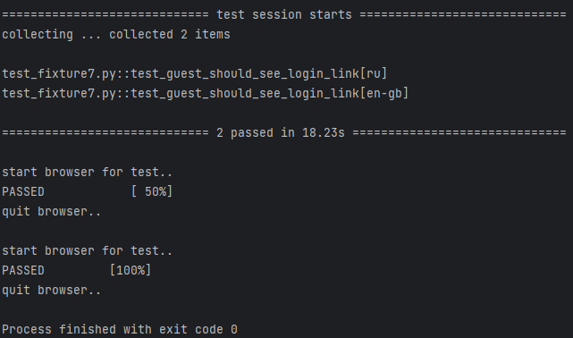

# PyTest — параметризация, конфигурирование, плагины

## Conftest.py — конфигурация тестов

В предыдущем разделе мы создали фикстуру браузера `browser`, которая создает экземпляр браузера для тестирования в
текущем файле.
Однако, когда у нас есть несколько тестовых файлов, может быть неудобно переопределять эту фикстуру в каждом файле.
Чтобы избежать этого повторения и сохранить часто используемые фикстуры и глобальные настройки, мы можем использовать
файл `conftest.py`, который должен находиться в каталоге верхнего уровня нашего тестового проекта.
Хотя можно создавать
дополнительные файлы `conftest.py` в других каталогах, любые настройки, определенные в этих файлах, будут применяться
только к тестам в подкаталогах.

Мы можем создать файл `conftest.py` в каталоге верхнего уровня нашего тестового проекта и переместить туда фикстуру
браузера для хранения часто используемых фикстур и глобальных настроек. Благодаря этому файл с тестами становится более
лаконичным.

> conftest.py:

```python
import pytest
from selenium import webdriver


@pytest.fixture(scope='function')
def browser():
    browser = webdriver.Chrome()
    yield browser
    browser.quit()
```

С добавлением файла `conftest.py` в корневой каталог тестового проекта доступ к фикстуре браузера теперь возможен для
всех тестовых файлов.
Фикстура передается тестовому методу в качестве аргумента, что позволяет легко повторно использовать
вспомогательные функции в разных частях проекта, независимо от того, сколько тестовых файлов создано.

> test_conftest.py:

```python
from selenium.webdriver.common.by import By

link = "http://selenium1py.pythonanywhere.com/"


def test_guest_should_see_login_link(browser):
    browser.get(link)
    browser.find_element(By.CSS_SELECTOR, "#login_link")
```

### ОЧЕНЬ ВАЖНО!

Крайне важно понять важный аспект поведения файлов конфигурации. PyTest автоматически обнаруживает и загружает файлы
`conftest.py` в каталог с тестами. Если у вас все тестовые сценарии в одной папке, будьте осторожны и не запускайте
тесты из папки с тестами, так как это может помешать автоматическому обнаружению файлов conftest.py:

```
tests/
├── conftest.py
├── subfolder
│   └── conftest.py
│   └── test_abs.py

следует избегать!
```

Если тесты запускаются из каталога, содержащего два файла conftest.py, будут применены оба файла, что может привести к
непредвиденным ошибкам и конфликтам.

Этот метод можно использовать для переопределения различных фикстур, но для знакомства рекомендуется придерживаться
одного файла для каждого проекта/задачи и сохранять их в горизонтальном порядке, например:

```
selenium_course_solutions/
├── section3
│   └── conftest.py
│   └── test_languages.py
├── section4 
│   └── conftest.py
│   └── test_main_page.py

правильно!
```

Подробнее можете ознакомиться в документации:
[Override a fixture on a folder (conftest) level](https://docs.pytest.org/en/7.1.x/how-to/fixtures.html?highlight=fixture%20folder#override-a-fixture-on-a-folder-conftest-level)

## Параметризация тестов

Используя декоратор `@pytest.mark.parametrize()` в PyTest, вы можете запустить один и тот же тест с различными входными
параметрами. Например, предположим, что наш веб-сайт доступен на разных языках. Мы можем написать тест, который
проверяет, отображается ли ссылка на форму входа для русской и английской версий главной страницы сайта. Мы можем
передать в наш тест ссылки на русскую и английскую версии главной страницы сайта.

Чтобы использовать декоратор `@pytest.mark.parametrize()`, вам необходимо указать параметр,
который необходимо изменить, и список значений параметров.
Тест также должен передавать параметр в качестве аргумента. Важно отметить, что при
использовании декоратора имя параметра заключается в кавычки, а в списке тестовых аргументов кавычки не нужны.

> test_fixture7.py:

```python
import pytest
from selenium import webdriver
from selenium.webdriver.common.by import By


@pytest.fixture(scope="function")
def browser():
    print("\nstart browser for test..")
    browser = webdriver.Chrome()
    yield browser
    print("\nquit browser..")
    browser.quit()


@pytest.mark.parametrize('language', ["ru", "en-gb"])
def test_guest_should_see_login_link(browser, language):
    link = f"http://selenium1py.pythonanywhere.com/{language}/"
    browser.get(link)
    browser.find_element(By.CSS_SELECTOR, "#login_link")
```

Запустите тест:

```shell
pytest -s -v test_fixture7.py
```

При запуске теста вы увидите два запущенных теста, при этом имя каждого теста отображает параметр, с которым он был
запущен, заключенный в квадратные скобки. Такой подход помогает увеличить количество проверок по схожим сценариям без
дублирования кода.



Чтобы указать параметры для всех тестов в классе, перед объявлением класса следует поставить знак параметризации. Это
применит указанные параметры ко всем тестам в классе:

```python
@pytest.mark.parametrize('language', ["ru", "en-gb"])
class TestLogin:
    def test_guest_should_see_login_link(self, browser, language):
        link = f"http://selenium1py.pythonanywhere.com/{language}/"
        browser.get(link)
        browser.find_element(By.CSS_SELECTOR, "#login_link")
        # этот тест запустится 2 раза

    def test_guest_should_see_navbar_element(self, browser, language):
        pass
        # этот тест тоже запустится дважды
```

Дополнительно ознакомьтесь с документацией
[How to parametrize fixtures and test functions](https://docs.pytest.org/en/latest/how-to/parametrize.html)

## Установка Firefox и Selenium-драйвера geckodriver

До сих пор мы выполняли наши тесты только в браузере Chrome. Однако что, если мы хотим протестировать наше
веб-приложение и в других браузерах? В таком сценарии мы можем запускать одни и те же тесты в разных браузерах, указав
имя браузера при запуске тестов. Например, мы можем выбрать Firefox в качестве второго браузера, поскольку он широко
используется и может работать на любой платформе. Чтобы запустить тесты в конкретном браузере, нам нужно указать
параметр `browser_name` при запуске с помощью следующей команды:

```shell
pytest -s -v --browser_name=firefox test_cmd.py
```

Установите последнюю версию браузера Firefox для вашей платформы:
[Firefox Browser](https://www.mozilla.org/en-US/firefox/new/)

Selenium-драйвер для Firefox носит название geckodriver.

Последнюю версию драйвера можно скачать [geckodriver](https://github.com/mozilla/geckodriver/releases)

Ознакомьтесь с [инструкцией по установке драйвера](https://selenium-python.com/install-geckodriver) и не забудьте
добавить его в PATH для пользователей с ОС Windows.

## Conftest.py и передача параметров в командной строке

На этом этапе мы разберемся, как настраивать тестовые среды, передавая параметры через командную
строку с помощью встроенной фикстуры request, которая может получать данные о текущем выполняемом тесте. Это может
позволить нам хранить дополнительные данные в отчете и выполнять ряд других полезных задач.

Это делается с помощью встроенной функции pytest_addoption и фикстуры request. Сначала добавляем в файле conftest
обработчик опции в функции pytest_addoption, затем напишем фикстуру, которая будет обрабатывать переданные в опции
данные.

Подробнее можно узнать в
документации: [pytest_addoption](https://docs.pytest.org/en/latest/example/simple.html?highlight=addoption)

Добавим логику обработки командной строки в файл `conftest.py`.
Мы можем получить значение параметра с помощью следующей команды:

```python
browser_name = request.config.getoption("browser_name")
```

> conftest.py:

```python
import pytest
from selenium import webdriver


def pytest_addoption(parser):
    parser.addoption('--browser_name', action='store', default=None,
                     help="Choose browser: chrome or firefox")


@pytest.fixture(scope="function")
def browser(request):
    browser_name = request.config.getoption("browser_name")
    browser = None
    if browser_name == "chrome":
        print("\nstart chrome browser for test..")
        browser = webdriver.Chrome()
    elif browser_name == "firefox":
        print("\nstart firefox browser for test..")
        browser = webdriver.Firefox()
    else:
        raise pytest.UsageError("--browser_name should be chrome or firefox")
    yield browser
    print("\nquit browser..")
    browser.quit()
```

> test_parser.py:

```python
link = "http://selenium1py.pythonanywhere.com/"


def test_guest_should_see_login_link(browser):
    browser.get(link)
    browser.find_element(By.CSS_SELECTOR, "#login_link")
```

Если вы теперь запустите тесты без параметра, то получите ошибку:

```shell
pytest -s -v test_parser.py
```

```
ERROR _pytest.config.exceptions.UsageError: --browser_name should be chrome or firefox
```

Чтобы избежать необходимости каждый раз указывать параметр `--browser_name` в командной строке, мы можем установить для
параметра значение по умолчанию.
Это можно сделать, добавив следующую строку в файл `conftest.py`:

```python
def pytest_addoption(parser):
    parser.addoption('--browser_name', action='store', default='chrome', help="Choose browser: chrome or firefox")

```

Запустите тесты на Chrome:

```shell
pytest -s -v --browser_name=chrome test_parser.py
```

И на Firefox:

```shell
pytest -s -v --browser_name=firefox test_parser.py
```

Тесты должны выполняться в разных браузерах.

## Плагины и перезапуск тестов

PyTest имеет широкий спектр
доступных [плагинов](https://docs.pytest.org/en/latest/explanation/flaky.html?highlight=plugins#plugins), которые могут
расширить функциональность фреймворка.
Полный список доступных плагинов можно найти [здесь](https://docs.pytest.org/en/latest/reference/plugin_list.html).

Обсудим еще одну распространенную проблему, часто возникающую при написании сквозных тестов в Selenium, — flaky-тесты
или «мигающие» автотесты. Это тесты, которые иногда проваливаются из-за внешних факторов, не зависящих от нас, или
из-за трудно воспроизводимых ошибок, хотя в большинстве случаев они успешно проходят. Это может произойти во время
тестов из-за одновременных обновлений сайта, проблем с сетью или странных совпадений. Несмотря на то, что устранение
таких проблем и выявление причин ошибок необходимо, в реальном мире это часто требует значительных усилий. Таким
образом, чтобы убедиться, что тест действительно обнаружил ошибку и не произошел случайный сбой, мы можем повторить
неудачный тест.

Реализация этого — простой процесс. Мы будем использовать плагин
[pytest-rerunfailures](https://pypi.org/project/pytest-rerunfailures/).

Изначально нам нужно установить плагин в нашу виртуальную среду. После установки плагин будет автоматически обнаружен
PyTest, и мы сможем использовать его возможности без внесения дополнительных изменений в код:

```shell
pip install pytest-rerunfailures
```

Чтобы установить количество повторных запусков неудачных тестов, вы можете добавить параметр командной строки: `--reruns
n`, где `n` представляет количество повторных запусков. Если тесты пройдены на любом из повторных запусков, тестовый
запуск будет считаться успешным, а количество повторных запусков будет отображаться в отчете для дальнейшего анализа
проблемных тестов.

Дополнительно мы указали параметр `--tb=line`, чтобы сократить лог с результатами теста:

```shell
pytest -v --tb=line --reruns 1 --browser_name=chrome test_rerun.py
```

Давайте напишем два теста: один из них будет проходить, а другой — нет. Посмотрим, как выглядит перезапуск.

> test_rerun.py:

```python
from selenium.webdriver.common.by import By

link = "http://selenium1py.pythonanywhere.com/"


def test_guest_should_see_login_link_pass(browser):
    browser.get(link)
    browser.find_element(By.CSS_SELECTOR, "#login_link")


def test_guest_should_see_login_link_fail(browser):
    browser.get(link)
    browser.find_element(By.CSS_SELECTOR, "#magic_link")
```

Вы увидите отчет о запуске тестов: "1 failed, 1 passed, 1 rerun in 50.16s", следовательно первоначально провалившийся
тест был перезапущен.

## Запуск автотестов для разных языков интерфейса

Цель: научиться запускать автотесты для разных локалей, т.е. для разных языков интерфейсов.

На предыдущем шаге мы запускали автотесты для разных языков, используя параметризацию с разными ссылками, но этот метод
становится сложным в управлении при работе с большим количеством тестов. Чтобы решить эту проблему, мы можем настроить
сервер так, чтобы он определял язык интерфейса для отображения на основе данных браузера. Когда пользователь делает
запрос на сервер, браузер отправляет данные о языке пользователя через параметр `accept-language` в заголовках
(заголовок запроса).
Если сервер получит запрос с заголовком `{accept-language: ru, en}`, он отобразит пользователю русскоязычный
интерфейс сайта. Если русский язык не поддерживается, то будет показан следующий язык из списка. Этот процесс аналогичен
установке предпочтительного языка в настройках вашего браузера.

Чтобы указать язык браузера с помощью WebDriver, используйте класс `Options` и метод `add_experimental_option`, как
указано в примере ниже:

```python
from selenium.webdriver.chrome.options import Options as chromeOptions

options = chromeOptions()
options.add_experimental_option('prefs', {'intl.accept_languages': language})
browser = webdriver.Chrome(options=options)
```

```python
from selenium.webdriver.firefox.options import Options as firefoxOptions

options = firefoxOptions()
options.set_preference('intl.accept_languages', language)
browser = webdriver.Firefox(options=options)
```

## Задание: запуск автотестов для разных языков интерфейса

Поскольку мы стремимся обеспечить бесперебойную работу создаваемого нами интернет-магазина для пользователей из всех
стран, нам необходимо протестировать многоязычное решение, запустив набор автотестов для каждого языка. Как разработчик
автотестов, вы должны создать решение, позволяющее выполнять автотесты для разных пользовательских языков, указав нужный
язык в командной строке.

1. Создайте GitHub-репозиторий, в котором будут лежать файлы conftest.py и test_items.py.
2. Добавьте в файл conftest.py обработчик, который считывает из командной строки параметр language.
3. Реализуйте в файле conftest.py логику запуска браузера с указанным языком пользователя. Браузер должен объявляться в
   фикстуре browser и передаваться в тест как параметр.
4. В файл test_items.py напишите тест, который проверяет, что страница товара на сайте содержит кнопку добавления в
   корзину. Например, можно проверять товар, доступный
   по http://selenium1py.pythonanywhere.com/catalogue/coders-at-work_207/.
5. Тест должен запускаться с параметром language следующей командой:
   `pytest --language=es test_items.py`
   и проходить успешно. Достаточно, чтобы код работал только для браузера Сhrome.
