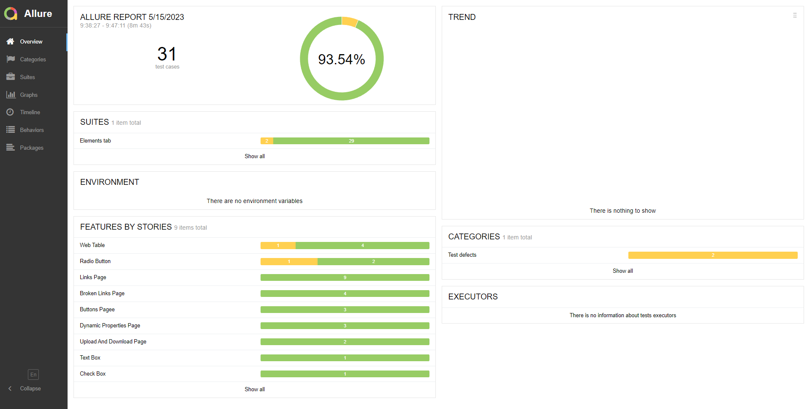

# Создание отчётов о тестировании с помощью фреймворка Allure

## Что такое отчёт о тестировании и зачем он нужен?

Отчётность - одна из важных составляющих проекта, которая всегда проблематична для составления. Если у вас нет примеров
для составления подобной документации на проекте, то вы обязательно зададитесь вопросами о том, что в неё написать, как
описать выполненные действия, зачем это вообще описывать и кто будет читать этот отчёт.

На самом деле, отчёт важен не только заказчику, чтобы посмотреть в каком состоянии находится выполнение текущего этапа
проекта, но и самой команде, чтобы разобраться в проблемных местах системы.

Отчет о результатах тестирования - периодический отчет, в котором документируется подробная информация о выполнении
теста и его результате. Также он содержит условия, предположения, ограничения теста, какой элемент теста кем
тестируется. Помимо этого вносится подробная информация об оставшейся работе, чтобы показать, сколько еще работы
необходимо выполнить в
проекте. [Виды отчетов (Reports) QA Bible](https://vladislaveremeev.gitbook.io/qa_bible/testovaya-dokumentaciya-i-artefakty-test-deliverablestest-artifacts/vidy-otchetov-reports)

Мы будем использовать фреймворк для создания отчётов [Allure Framework](https://github.com/allure-framework), но давайте
сначала зададимся вопросом "А действительно ли необходимо использовать какой-то инструмент для формирования отчёта?".

## Стоит ли использовать инструменты формирования отчётов?

Использование инструмента создания отчетов, такого как Allure, не является обязательным, но оно может дать несколько
преимуществ, когда речь идет о создании отчётов по тестированию и их анализе. Разберём несколько причин, по которым
использование инструмента создания отчетов является более целесообразным:

1. Усовершенствованные отчёты о тестировании. Инструменты создания отчётов предоставляют более структурированные и
   визуально привлекательные отчёты по сравнению с выходными данными программы запуска тестов по умолчанию. Эти отчёты
   могут включать дополнительную информацию, такую как этапы тестирования, вложения (снимки экрана, журналы и т. д.) и
   общее состояние тестирования. Это облегчает понимание результатов тестирования и выявление проблем.

2. Исторические данные и тренды. Инструменты генерации отчётов часто имеют возможность сохранять исторические данные
   испытаний и генерировать отчёты о трендах. Это позволяет вам отслеживать ход ваших тестов с течением времени,
   выявлять закономерности и принимать решения для улучшения тестов на основе данных.

3. Совместная работа и документация. Отчёты могут служить артефактом документации для ваших тестов, облегчая членам
   команды и заинтересованным сторонам просмотр и понимание результатов тестирования. Он способствует совместной работе
   и предоставляет централизованное место для общения и обсуждения результатов тестирования.

4. Интеграция с CI/CD. Многие инструменты генерации отчётов хорошо интегрируются с конвейерами непрерывной
   интеграции/непрерывного развертывания (CI/CD). Они могут автоматически генерировать отчёты после каждого запуска
   тестов и предоставлять сводку результатов. Это обеспечивает плавную интеграцию в существующий рабочий процесс
   разработки.

Хотя использование инструмента создания отчётов не является обязательным, он может значительно улучшить аспекты
визуализации, анализа и совместной работы при выполнении теста. В конечном итоге это зависит от требований вашего
проекта и уровня отчётности и анализа, необходимых для ваших тестов.

## Использование Allure

### Установка зависимостей

Вам понадобится сам фреймворк [allure-python](https://github.com/allure-framework/allure-python/releases).

Мы будем использовать генерацию отчёта в HTML, для этого нам понадобится
библиотека [allure-pytest](https://pypi.org/project/allure-pytest/).

После установки зависимостей в вашу виртуальную среду не забудьте добавить их в `requirements.txt`.

### Маркирование шагов, тестовых наборов, фичей и тестов

Посмотрим на применение маркировки тестов для страницы [Accordian DEMOQA](https://demoqa.com/accordian).

```python
@allure.suite('Alerts Frame Windows tab')
class TestAlertsFrameWindows:
    """Class represents Alerts, Frame & Windows tab.
    Contains tabs:
    Browser Windows,
    Alerts,
    Frames,
    Nested Frames,
    Modal Dialogs.
    """
    EXPECTED_TEXT = 'This is a sample page'

    @allure.feature('Browser Windows')
    class TestBrowserWindows:
        """Class represents Browser Windows tab tests."""
        browser_windows_page_link = 'https://demoqa.com/browser-windows'

        @allure.title('Test opening a new tab and getting the text from it.')
        def test_new_tab(self, driver: WebDriver):
            """Test opening a new tab and getting the text from it."""
            browser_windows_page = BrowserWindowsPage(driver=driver, url=self.browser_windows_page_link)
            browser_windows_page.open()
            new_tab_text = browser_windows_page.check_opened(what_to_open='tab')
            assert new_tab_text == TestAlertsFrameWindows.EXPECTED_TEXT, \
                f'New tab text should be \'{TestAlertsFrameWindows.EXPECTED_TEXT}\'' \
                f' but got {new_tab_text}'

```

Обратите внимание, что мы объявили класс TestAlertsFrameWindows тестовым набором с помощью
декоратора `@allure.suite('Alerts Frame Windows tab')`, в который входит большой перечень фичей: Browser Windows,
Alerts, Frames и т.д. Каждую фичу мы должны пометить декоратором `@allure.feature()` с названием самой фичи. Фича
представляет собой класс хранящий в себе тесты посвященные определённой тематике. Каждый тест отметим
декоратором `@allure.title()` внутри которого стоит указать название нашего теста. Хорошей практикой является
придерживаться форматов именования тестов, которые приняты на вашем проекте и используются в ручном тестировании.

Давайте посмотрим на пример декорирования шагов тестового сценария:

```python
class BrowserWindowsPage(BasePage):
    """Browser Windows page object."""
    locators = BrowserWindowsPageLocators()

    @allure.step('Check if new tab of window is opened.')
    def check_opened(self, what_to_open: str) -> str:
        """
        Check if new tab of window is opened.
        :param what_to_open: Element to open.
            tab -> open the tab.
            window -> open the window.
        :returns: title of new tab or window.
        """
        available_cases = {
            'tab': self.locators.NEW_TAB_BUTTON,
            'window': self.locators.NEW_WINDOW_BUTTON
        }
        with allure.step(f'Click on {what_to_open}'):
            self.element_is_clickable(locator=available_cases[what_to_open]).click()
        with allure.step('Switch to new tab'):
            self.switch_to_new_tab()
        with allure.step('Get title text'):
            text_title = self.element_is_present(locator=self.locators.SAMPLE_TEXT).text
        return text_title

```

Каждое действие метода-проверки помечается соответствующим декоратором. Не забывайте писать осмысленные сообщения о
действии в шаге и никогда не пропускайте шаги вашего тест-кейса.

### Получение скриншотов экрана

Вы можете получать скриншоты экрана с помощью средств автоматизации и прикреплять их к вашему отчёту. Это будет удобно
для визуального наблюдения дефекта, когда вы запускаете автотесты в `headless` режиме или ставите ночной прогон тестов.

```python
@pytest.fixture(scope='function')
def driver():
    """Google Chrome is used as driver."""
    driver = webdriver.Chrome(service=ChromeService(ChromeDriverManager().install()))
    driver.maximize_window()
    yield driver
    screenshot = driver.get_screenshot_as_png()
    allure.attach(
        body=screenshot,
        name=f'Screenshot {datetime.today()}',
        attachment_type=allure.attachment_type.PNG
    )
    driver.quit()

```

## Готовый отчёт о тестировании

Используйте приведённые примеры для оформления ваших собственных методов, тестовых наборов и тестов.

Чтобы получить отчёт о тестировании вам необходимо использовать команду с указанием директории для сохранения файлов
отчёта: `pytest --alluredir=allure_results .\tests`, где `tests` - директория, содержащая все тесты, `allure_results` -
директория для сохранения файлов отчёта.

Чтобы собрать свой отчёт в HTML используйте команду `allure serve allure_results`.

Откроется окно браузера, в котором у вас будет готовый отчёт по тестированию.


