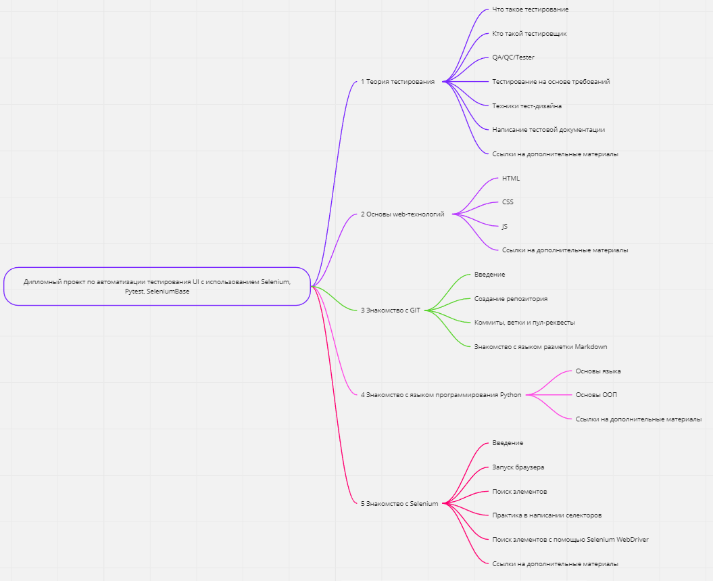
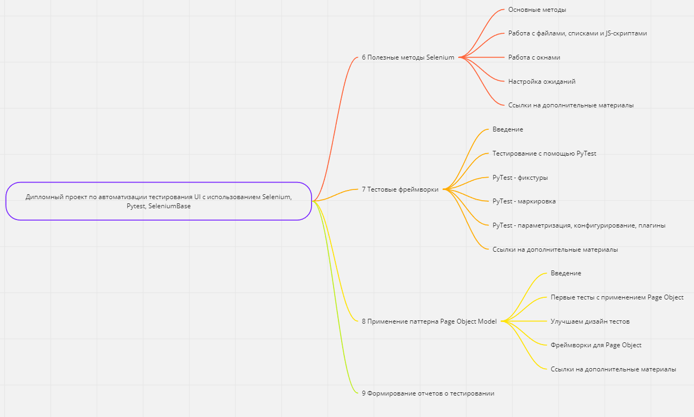

GoogleDrive version: https://drive.google.com/drive/folders/1bZ-n4Njvb_TJylEwaEc0bbvC3uKMCVR-?usp=drive_link

 Geekbrains 

 Факультет тестирования ПО 

---

# 
<strong> Автоматизация тестирования UI с использованием Selenium </strong>

  
  

<strong> Дипломная работа </strong>

 специальности "Программист JAVA" 

  
  

 Радужный 2023 

---

## Структура диплома

---

## Введение

### Актуальность

Автоматизация проникает во все сферы деятельности человека, избавляет от рутин и тестирование ПО не исключение.
Автоматизация позволяет разгрузить тестировщика от рутинных проверок во время ретеста и регрессивного тестирования. А
также для повышения качества разрабатываемого продукта путем встраивания в цикл непрерывной интеграции и непрерывной
доставки. Актуальность темы дипломной работы связана со значительным распространением автоматизации тестирования и языка
программирования Python и заключается в необходимости разработки рекомендаций по изучению данного направления для
начинающих и практикующих специалистов по обеспечению качества.

### Цели и задачи

Цель дипломной работы является разработка дорожной карты развития начинающего специалиста по обеспечению качества
разработки ПО. Познакомить с инструментами и сформировать компетенции для успешного развития в направлении автоматизации
тестирования на языке программирования Python.

Задачами дипломной работы в связи с указанной целью являются:

* изучить основные понятия теории тестирования;
* исследовать наиболее распространенные web-технологии;
* изучить систему контроля версий GIT;
* изучить базовые возможности языка программирования Python;
* изучить основные возможности и методы Selenium;
* исследовать расширение возможностей тестирования с помощью фреймворков;
* раскрыть необходимость использования паттерна Page Object Model;
* изучить различные методы формирования отчетов о тестировании.

### Объект и предмет исследования

Объектом дипломной работы является изучение начинающим специалистом автоматизации на языке Python для тестирования
пользовательского интерфейса сайтов, и способы ускорения профессионального развития в данном направлении.

Предметом дипломной работы являются открытые источники в сети интернет, книги и курсы посвященные тестированию ПО.

### Научная и практическая значимость

Научная новизна заключается в нахождении нового подхода к обучению специалистов в направлении автоматизации на языке
программирования Python.

Практическая значимость заключается в снижении времени, необходимого для получения навыков, необходимых для
использования в автоматизации тестирования UI web-приложений.

## Рекомендации по изучению

Дипломный проект представляет из себя курс по освоению (или расширению уже имеющихся) знаний в области автоматизации
тестирования на языке программирования Python.

Рекомендуется проходить курс последовательно и самостоятельно изучать дополнительные материалы. Ссылки на некоторые
материалы будут приведены по ходу курса, но рекомендуется проводить самостоятельную работу по поиску актуальной
информации.
